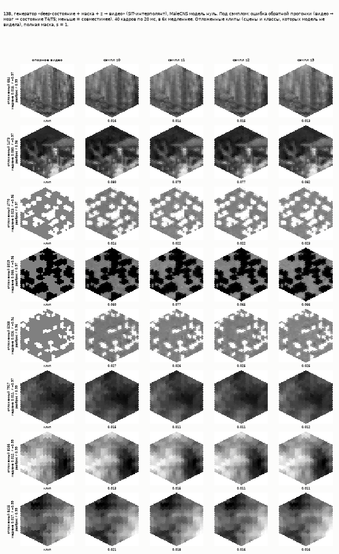

# Что снится мухе? / What Does a Fly Dream Of?

Модель зрительной системы дрозофилы на проводке коннектома **MaleCNS** и
генератор, который превращает состояние этой модели в **видео**. Затем —
попытка получить видео, у которого нет исходного клипа: из состояния мозга,
разыгранного выученным распределением.

```
видео → глаз (721 гексагональная колонка) → модель правой зрительной доли на проводке MaleCNS
      → состояние детекторов движения T4/T5 → условный поток (SiT) → видео
      → повторный прогон через ту же замороженную модель

ε ~ N(0, I) → поток на гексагональной решётке → состояние → тот же генератор → новое видео
```



Это результаты **модели**, а не записи живой мухи. Видео из состояния — это
стимул, наиболее совместимый с этим состоянием в этой модели, а не то, что
видит муха. «Сон» в названии — вопрос проекта, не утверждение.

Весь путь подробно — в двух частях статьи:
[часть 1, от коннектома до видео из состояния](reports/2026-09-19_master_article_draft.md) и
[часть 2, генерация без исходного клипа](reports/2026-09-23_master_article_part2_draft.md).

## Главное

**1. Коннектом MaleCNS внутри архитектуры FlyVis.** Проводка правой
зрительной доли экспортирована в фильтры `тип → тип → смещение колонки` на
гексагональной решётке: 60 типов, 31 526 узлов, 1,35 млн рёбер. На неё
перенесены обученные параметры FlyVis. Первая валидация нашла ошибку
переноса: усиление в FlyVis нормировано на число синапсов *его* коннектома,
и простое копирование убивало направленную избирательность (DSI 0,020 против
0,391). После исправления — 0,152. Модель работает и остаётся заметно более
слабым детектором направления, чем FlyVis; это сказано прямо.

**2. Видео из состояния мозга.** Инверсия через замороженную модель
восстанавливает вызвавший состояние ролик (r 0,93–1,00 по десяти уровням).
Условный поток SiT (1,4 млн параметров, $0,22 на обучение) делает то же за 20
шагов: **r 0,966** к исходному видео на восьми отложенных клипах. При одном и
том же шуме замена состояния на перемешанное даёт другое видео (r 0,03 между
выходами) — картинку задаёт состояние, а не априорное знание модели.

**3. Генерация без исходного клипа: структура есть, сцена не доказана.** Поток
над состояниями прошёл путь от «соли с перцем» до локальной архитектуры на
гексагональной решётке: патчи паросочетанием Куна, локальное внимание,
относительные смещения, регистровые токены. Задача сужена до одной
неподвижной картинки — 721 × 2 числа вместо 721 × 32. Розыгрыши совпадают с
настоящими состояниями по доле ровного поля (27,1 % при 27,1 %) и соседней
когерентности (0,928 при 0,949), контроль без потока — нет (19,5 %, 0,492).
Сцена не доказана: нужны порождающий отрисовщик и метрика «это сцена».

**4. Метрики, которые лгали, и как мы это нашли.** Круговой ход через мозг
ставил почти пустому серому полю оценку лучше настоящего клипа.
Покоординатный эксцесс покупается схлопыванием выхода. Поток выучил второй
момент распределения, но не четвёртый. У каждого судьи теперь есть измеренный
пол, у каждого результата — контроль из того же прогона. Все найденные дефекты
— в [ISSUES.md](ISSUES.md).

**5. Инженерия: много экспериментов на одной T4.** Весь проект стоил около
**$13** облачного GPU.
- Независимые задачи упаковываются в одну batch-ось, загрузка T4 — 98–99,9 %.
- Пакетная инверсия быстрее последовательной в 7×.
- Свой рендер фасеточного глаза — в 60 раз быстрее и побитово совпадает с
  FlyVis.
- PCA 13 555 × 92 288 через матрицу Грама на карте — 43 с и $0,02.
- Обращение потока неподвижной точкой: ошибка 0,243 → 0,0058.
- Профилирование вместо догадки: гипотеза «упираемся в запуск ядер»
  опровергнута, `torch.compile` дал 54,7 → 38,5 мс на шаг.

## Коротко о прочем

- **Декодирование по уровням** — ridge и гексагональная свёртка с контролями;
  «лестница потери информации вглубь» оказалась свойством окна декодера.
  [Отчёт](reports/2026-09-18_step4_decoder_stack.md).
- **Амортизированная инверсия** — линейная модель и CNN, r 0,927 и 0,960.
  [Отчёт](reports/2026-09-19_step13a_amortised_inversion.md).
- **Композиции состояний и замкнутый цикл** «мозг ↔ генератор».
  [Отчёт](reports/2026-09-20_step14_controllable_generator.md).
- **Корпус обычного видео** — 15 514 клипов UCF101 через глаз мухи, сплит по
  классам. [Отчёт](reports/2026-09-20_step18_corpus_of_ordinary_video.md).
- **VAE против PCA** — латент разыгрывается, но реконструкция 0,687 против
  0,890 у линейной PCA той же размерности.
  [Отчёт](reports/2026-09-20_the_seed_problem.md).
- **Аудит метрик** — полы всех судей.
  [Отчёт](reports/2026-09-21_the_draw_distribution.md).
- Все отчёты по шагам, с номерами прогонов, — в [`reports/`](reports/);
  журнал всех измерений — [`reports/runs.jsonl`](reports/runs.jsonl).

## Запуск

Python 3.12, [uv](https://docs.astral.sh/uv/).

```bash
uv sync
uv run pytest -q
```

146 офлайн-тестов на синтетическом миниатюрном коннектоме: без скачиваний,
без облака, без ключей. Данные MaleCNS скачиваются через neuPrint
(`NEUPRINT_TOKEN` в `.env`, образец — `env.example`); GPU-шаги идут на Modal.
Команды по шагам — в [`docs/OPERATIONS_MAP.md`](docs/OPERATIONS_MAP.md).

## Устройство репозитория

```text
flydream/        пакет: data (экспорт MaleCNS), model (модель ноль), decode (декодеры), generate (генераторы и приоры), train
deploy/modal/    функции Modal на T4: обучение, декодирование, генерация
tools/           журнал прогонов, фигуры
tests/           офлайн-тесты
reports/         отчёты по шагам, статья, runs.jsonl
research_notes/  заметки по литературе за отчётами
docs/            карта системы, карта операций, как оформляется результат
ROADMAP.md       текущий план
DECISIONS.md     принятые решения и почему
ISSUES.md        найденные дефекты
```

Данные, активность и чекпойнты в репозиторий не входят.

## Данные и лицензии

- **MaleCNS v1.0** (Janelia FlyEM) — CC-BY 4.0.
- **FlyVis 1.2.0** — MIT.
- **UCF101** — набор для исследовательского использования.
- **Sintel** — через кэш FlyVis.

## Ссылки

- MaleCNS: https://male-cns.janelia.org/ ; Berg et al., bioRxiv 2025.10.09.680999, Cell 2026
- FlyVis: https://github.com/TuragaLab/flyvis ; Lappalainen et al., Nature 634:1132 (2024)
- Optic lobe inventory: Nern et al., Nature 641:1225 (2025)
- Encoder inversion: Bauer, Margrie & Clopath, eLife 105081 (2026)
- Layer-wise decodability: Chen et al., PLOS Comput Biol 20:e1012297 (2024)
- SiT: Ma et al., ECCV 2024; flow matching: Lipman et al., ICLR 2023
- Decoding spontaneous activity: Horikawa & Kamitani, Science 340:639 (2013)
