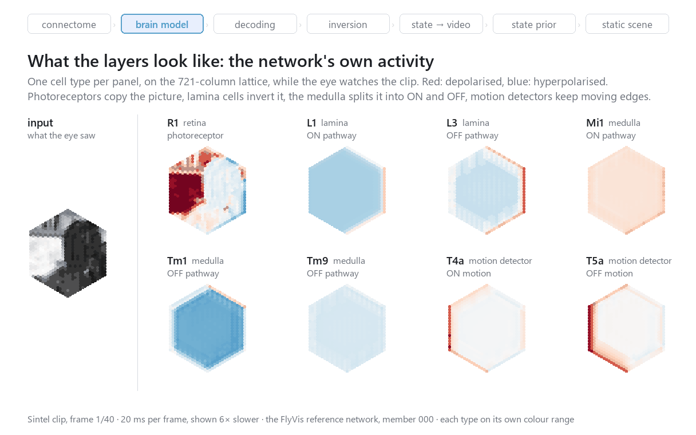
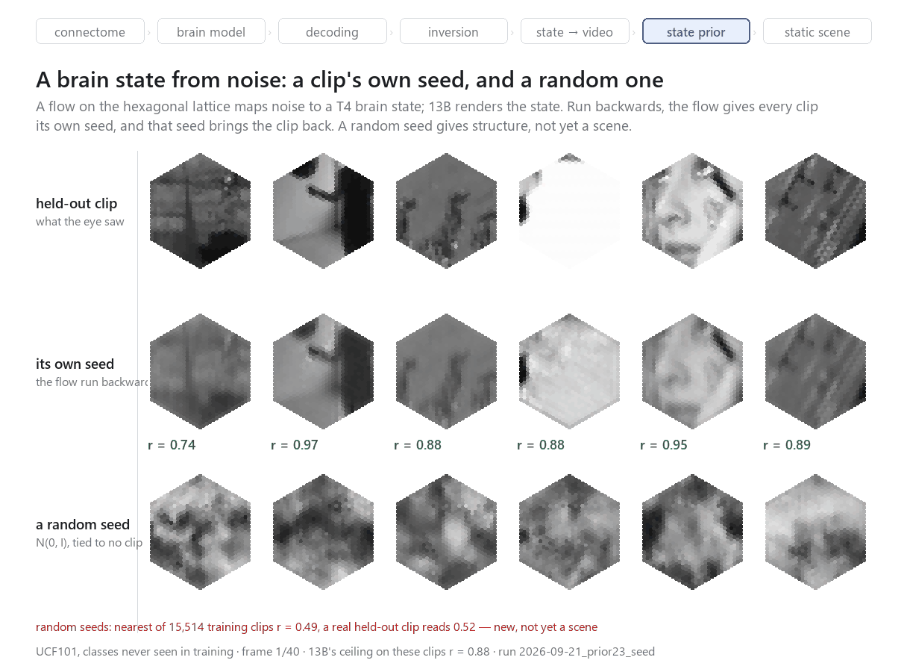
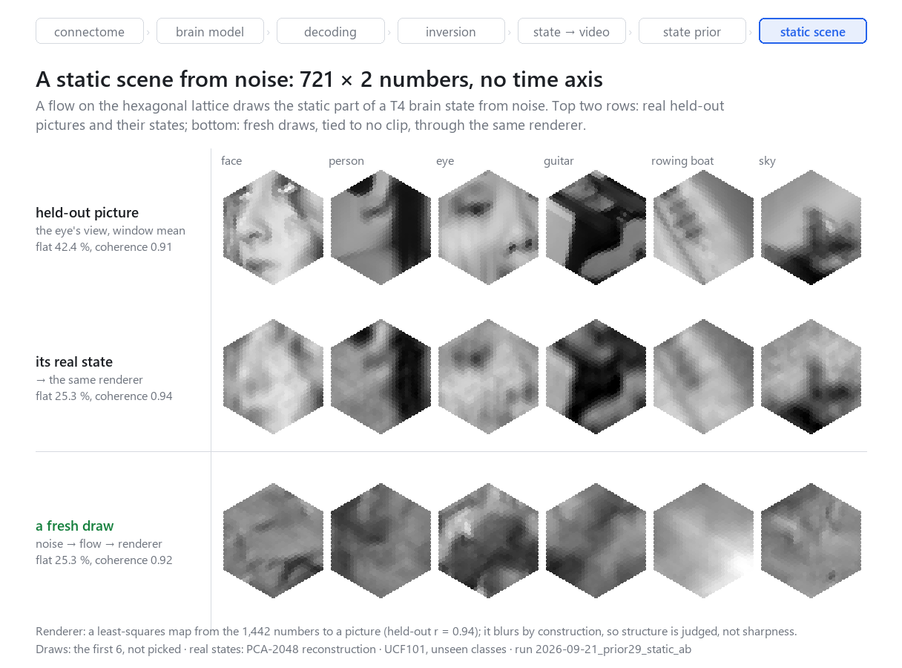

# What Does a Fly Dream Of?

**Video from the brain state of a connectome-constrained model of the fruit fly visual system.**

[Article, part 1](reports/2026-09-19_master_article_draft.md) · [Article, part 2](reports/2026-09-23_master_article_part2_draft.md) · [Figures](docs/figures/) · [Run log](reports/runs.jsonl)



We take the **MaleCNS** connectome of the fruit fly, wire its right optic lobe into the
trainable architecture of **FlyVis** (Lappalainen et al., Nature 2024), and run the model
backwards: from the activity of any layer to the video that caused it, from the state of the
motion detectors to video in a single generative pass, and finally from noise to a brain
state that no clip caused. The model reproduces the eye's ON/OFF split and, more weakly
than FlyVis, its motion computation; video is recovered from every layer, including the
motion detectors; and a flow on the hexagonal lattice of the eye learns the distribution of brain states well enough
that its draws match real states in structure — though not yet as recognisable scenes.

Everything here is a model, not a recording of a fly: a video recovered from a state is the
stimulus most compatible with that state in this model.

## Highlights

- **A connectome-constrained visual model on MaleCNS** — 60 cell types, 31,526 units,
  1.35 M synapse-derived edges on 721 hexagonal columns, running FlyVis's trained dynamics.
- **Video from any layer** — inverting the frozen model recovers the input from
  photoreceptors to motion detectors (r 0.93–1.00), where a linear decoder loses it with depth.
- **A one-step generator from brain state to video** — a conditional flow (SiT, 1.4 M
  parameters) at r 0.966 on held-out clips; the state, not the generator's prior, makes the
  picture.
- **Brain states from noise** — a flow on the eye's hexagonal lattice; each clip has a seed
  that returns it at the renderer's ceiling; fresh draws match real states in structure.
- **Measured, not asserted** — every result stands beside a control from the same run;
  the metrics that turned out to be wrong are documented, not hidden.
- **The whole project for about $13 of GPU** — one T4, 98–99.9 % utilisation per run.

## Pipeline

```
video ─► fly eye ─► optic-lobe model on the MaleCNS wiring ─► brain state ─► generator ─► video
            721 hexagonal columns        60 types, FlyVis dynamics         T4/T5 motion detectors
noise ─► flow on the hexagonal lattice ─► brain state ─► generator ─► new video
```

| stage | what it does | result |
|---|---|---|
| Connectome | MaleCNS neurons → home column from their synapses → `type → type → column offset` filters | column tag agreement 96.9 %; 61 of 65 FlyVis types matched |
| Brain model | FlyVis parameters transplanted onto the MaleCNS wiring | direction selectivity 0.020 → **0.152** after fixing the transfer (FlyVis 0.391) |
| Decoding | ridge decoder per cell type, split by scene | retina and lamina r 1.00; motion detectors 0.71–0.83 |
| Inversion | optimise the input until the frozen model reproduces one layer | **r 0.93–1.00** on every layer; control (another clip's activity) −0.20 |
| State → video | 13B: conditional SiT flow over the T4/T5 state | **r 0.966** held out; same noise, shuffled state: r 0.03 |
| State prior | flow over brain states on the hexagonal lattice | own seed returns its clip at r 0.88 (the ceiling); draws new, not yet scenes |
| Static scene | the same flow over the static part of the state, 721 × 2 numbers | draws match real states on structure (flat field 25.3 % vs 25.3 %) |

## Results

### Generating a brain state from noise

The flow that learned the distribution of brain states works on the eye's lattice itself:
tokens are patches of exactly three neighbouring columns, attention is local, positions are
relative. Run backwards, it gives every clip its own seed, and that seed brings the clip back.
A random seed gives new video — its nearest of 15,514 training clips is at r 0.49, where a
real held-out clip reads 0.52 — with structure, not yet a scene.



### A static scene

The current target is one still picture: the static part of the motion detectors' state, with
time removed from the task. Fresh draws match real states on the structural judges. Whether
they are scenes is not settled yet: the renderer below is a least-squares stand-in that blurs
by construction, and a scene metric from image generation is the next step.



## Findings

- **Transferring trained parameters between connectomes is not a copy.** FlyVis's synaptic
  gain is normalised by its own synapse counts; copied onto MaleCNS it silently blinded the
  motion detectors. Rescaling by total input fixed most of it.
- **"Information is lost with depth" was a decoder artefact.** The layer ranking flipped
  with the decoder's time window. The picture is still in the deep layers — inversion gets it
  back; a linear readout does not.
- **A random seed misses the data by geometry.** In 92,288 dimensions Gaussian noise lies on
  a thin shell, and the seeds of real clips sit 73 standard deviations inside it.
- **Architecture beat size.** Shrinking the state fourfold changed nothing; keeping the
  hexagonal lattice in the flow moved every metric at once — kurtosis of draws 4.11 → 5.36
  (data 8.31), radius overshoot 20 % → 6.4 %, sharpness 11 → 22 of 100.
- **Motion detectors carry a still picture.** A frame held still for the whole window renders
  back at r 0.953, better than a moving clip.
- **Metrics lie in specific ways.** The round trip through the brain scored a blank grey
  field above a real clip; kurtosis can be bought by collapsing the output. Each judge now
  has a measured floor.

## Engineering

| what | how | effect |
|---|---|---|
| Batched inversion | 20 independent tasks (10 layers + 10 controls) in one batch axis, per-task masks and losses | ~7× faster, identical to 7 × 10⁻⁴ |
| Fly-eye renderer | running sums read only at the ~31 columns and ~61 rows that carry a receptor | 60× faster, bit-for-bit equal to FlyVis |
| Exact flow inversion | 4 fixed-point iterations per Euler step | error 0.243 → 0.0058 |
| Compact state | temporal DCT, 16 of 40 coefficients, K chosen by measured round trip | 230,720 → 92,288 numbers per state |
| Type mask as input | "type not given" instead of "type is zero" in the generator | T4 alone 0.837 → 0.904 |
| Hex patches | Kuhn matching: every token exactly three columns | equivariant tokens without absolute position |
| PCA on the card | 13,555 × 92,288 through the Gram matrix | 43 s, $0.02 |
| Step profiling | measured fixed vs per-sample cost; `torch.compile` | 54.7 → 38.5 ms per step |
| Full-card rule | independent jobs packed until the T4 is saturated; 1 CPU / 12 GB beside it | 98–99.9 % utilisation, $0.05–0.51 per run |

## Getting started

```bash
git clone https://github.com/Grigoriy-V/fly-brain.git
cd fly-brain
uv sync                  # Python 3.12
uv run pytest -q         # 146 offline tests on a synthetic miniature connectome
```

The offline tests need no data, cloud or credentials. Building the model from MaleCNS needs a
neuPrint token (`.env`, see `env.example`); GPU training runs on [Modal](https://modal.com).
Commands for every stage are in [`docs/OPERATIONS_MAP.md`](docs/OPERATIONS_MAP.md). Every
figure is made by a script in [`tools/`](tools/), for example:

```bash
uv run python tools/fig_gh_static.py      # docs/figures/static_draws.png
```

## Repository

```text
flydream/        data (MaleCNS export) · model (model zero) · decode · generate (generators, priors)
deploy/modal/    GPU functions: training, decoding, generation
tools/           figure scripts, run log
docs/figures/    figures of this README and the articles
reports/         the working lab notebook: step reports, the articles, runs.jsonl — one record per measured outcome
ROADMAP.md · DECISIONS.md · ISSUES.md   plan · design decisions · known defects
```

The project was carried out together with an AI coding agent, and `reports/`, `ROADMAP.md`,
`DECISIONS.md` and `ISSUES.md` are kept as they were written during the work: a lab notebook,
with the owner's instructions, the agent's own mistakes and every correction. The articles and
this README are the edited account.

## Status and limitations

- The model is a weaker motion detector than FlyVis, and its OFF pathway carries a known
  spatial defect ([ISS-0015](ISSUES.md)); every state used by the generators comes from it.
- Draws from noise have structure but are not yet recognisable scenes; the static renderer is
  a least-squares stand-in.
- The eye has 721 columns (about 31 × 31): every picture is small by construction.
- There is no autonomous source of activity inside the model yet — the "dream" proper.

## Citation

```bibtex
@misc{voyakin2026flydream,
  title  = {What Does a Fly Dream Of? Video from the brain state of a connectome-constrained
            model of the fruit fly visual system},
  author = {Voyakin, Grigoriy},
  year   = {2026},
  note   = {https://github.com/Grigoriy-V/fly-brain}
}
```

## Acknowledgements and licences

Code under MIT ([LICENSE](LICENSE)). Built on MaleCNS v1.0 by Janelia FlyEM (CC-BY 4.0;
Berg et al., Cell 2026) and FlyVis 1.2.0 (MIT; Lappalainen et al., Nature 2024). Natural video
from UCF101 (research use) and Sintel through FlyVis's dataset cache. Methods borrowed from
encoder inversion (Bauer, Margrie & Clopath, eLife 2026), layer-wise decodability (Chen et al.,
PLOS Comput Biol 2024) and SiT (Ma et al., ECCV 2024).
