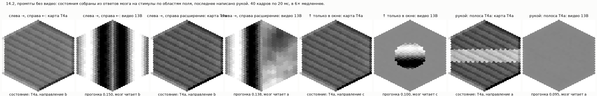

# What Does a Fly Dream Of?

Russian: «Что снится мухе?»

A connectome-constrained model of the fruit fly visual system on the MaleCNS
connectome, with a **video generator conditioned on the model's T4/T5
activity**. The right optic-lobe model has 31,526 units and about 1.39 million
edges. A conditional flow model (SiT, 20 Euler sampling steps) turns its
activity into a new video. We run that video back through the frozen visual
model to test whether it reproduces the requested activity.

On eight held-out clips, the generator reaches mean per-frame correlation
`r=0.966` and a neural-state round-trip error of `0.031`, versus `0.957` for
a shuffled-state control. Spatial compositions of the model's own responses
also produce compatible videos; arbitrary channel swaps and random activity
usually do not. These are results from a *model*, not recordings of a fly.
The title is a metaphor, not a claim about subjective experience or sleep.

The [master article draft](reports/2026-09-19_master_article_draft.md) tells
the whole process, from MaleCNS export and model validation through decoder
baselines, GPU batching, inversion and SiT. It separates measured results
from ideas for future experiments.

The idea is [`what_does_a_fly_dream_of.md`](what_does_a_fly_dream_of.md). The
research behind the plan, in Russian, is
[`reports/Коннектом мухи и план проекта.md`](reports/Коннектом%20мухи%20и%20план%20проекта.md)
with its primary-source notes under `research_notes/`.

## The shape (2026-09-19)

- **Connectome:** MaleCNS v1.0 (Janelia FlyEM, male brain + both optic lobes
  + VNC, 166,691 neurons, CC-BY 4.0), from the first step. FlyWire is a
  cross-check on a female; BANC has no lamina and is not used.
- **Model class:** the deep mechanistic network of FlyVis (Lappalainen et
  al., Nature 2024): rate-based point neurons, connectivity and synaptic
  signs fixed by the connectome, a few hundred free parameters per cell type
  and type pair, trained on optic flow. FlyVis's pretrained ensemble is the
  initialisation and the validation target; its connectome (FIB-25 and
  FIB-19 tiled over 721 columns) is not the substrate.
- **Decoding and generation:** ridge and hexagonal convolution baselines;
  gradient-based input inversion; a deterministic 13A decoder; a conditional
  13B SiT generator from eight T4/T5 types. Round-trip through the frozen
  visual model checks compatibility with the conditioning state.
- **Compute:** the owner's CPU for everything that fits in hours; a Modal T4
  for GPU-bound training or inversion; MaleCNS fine-tuning is paused.
- **Framing:** generated video is a model output conditioned on simulated
  activity. It is not a percept. An autonomous source of internal activity
  remains a deferred design (`ROADMAP.md`, item 16).

## One measured example

The image pairs composite T4/T5 state maps with generated videos. The first
three prompts combine actual model responses across regions; the final
hand-written T4a stripe is a useful failure case. Clips are 40 frames at
20 ms per frame, displayed six times slower. Round-trip errors for the
compositions are `0.100–0.150`; the stripe produces a nearly grey video.



Protocol and controls: [step 14 report](reports/2026-09-20_step14_controllable_generator.md).

## Layout

```text
what_does_a_fly_dream_of.md   the idea, as written
AGENTS.md / CLAUDE.md         how work is done here, by a person or an agent
ROADMAP.md                    the only plan
DECISIONS.md                  approved durable choices and why
ISSUES.md                     observed defects
docs/                         PROJECT_MAP (system shape), OPERATIONS_MAP (data, Modal, runs), ARTEFACTS (how a result is delivered), ideas/ (the owner's own notes)
reports/                      evidence, dated; research reports; runs.jsonl
research_notes/               literature notes behind each research report
data/                         (not committed) connectome tables, stimuli, activity, checkpoints
flydream/                     the package: data (MaleCNS export), model (model zero), decode (the ladder), generate (the generator), train (flyvis's solver on the export)
tools/                        run_log (the only writer of reports/runs.jsonl), modal_watch, figure scripts
tests/                        77 offline tests on synthetic connectomes and decoder/generator data
deploy/modal/                 Modal apps on a T4: train_app, decode_app, generate_app
```

## Where things are decided

[`ROADMAP.md`](ROADMAP.md) is the only plan. [`DECISIONS.md`](DECISIONS.md)
holds the durable choices and why. [`ISSUES.md`](ISSUES.md) holds the defects,
observed, whether or not anyone means to fix them. [`AGENTS.md`](AGENTS.md)
is how work is done here.

## Key references

- MaleCNS: https://male-cns.janelia.org/ ; Berg et al., bioRxiv 2025.10.09.680999, Cell 2026
- FlyVis: https://github.com/TuragaLab/flyvis ; Lappalainen et al., Nature 634:1132 (2024)
- Optic lobe inventory: Nern et al., Nature 641:1225 (2025)
- Whole-brain LIF: Shiu et al., Nature 634:210 (2024)
- Encoder inversion: Bauer, Margrie & Clopath, eLife 105081 (2026)
- Layer-wise decodability: Chen et al., PLOS Comput Biol 20:e1012297 (2024)
- Decoding spontaneous activity: Horikawa & Kamitani, Science 340:639 (2013); Front Comput Neurosci 11:4 (2017)
- Fly sleep and vision: Raccuglia et al., Nature 2025; Van De Poll & van Swinderen, J Exp Biol 228 (2025)
