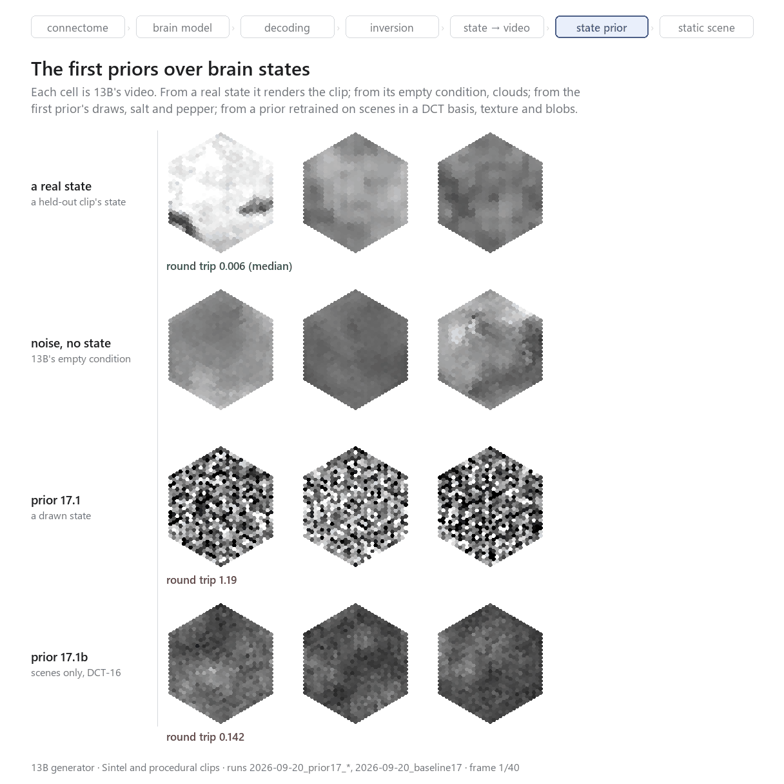
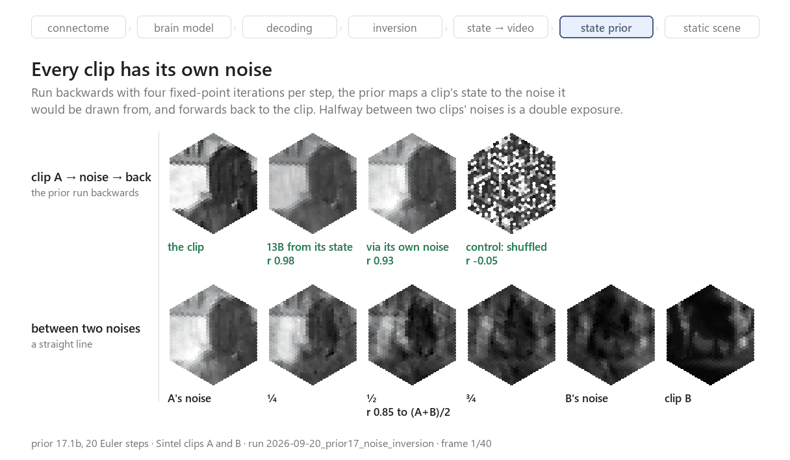
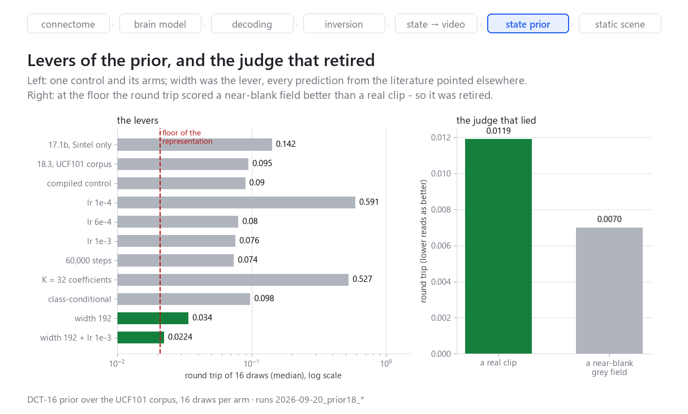
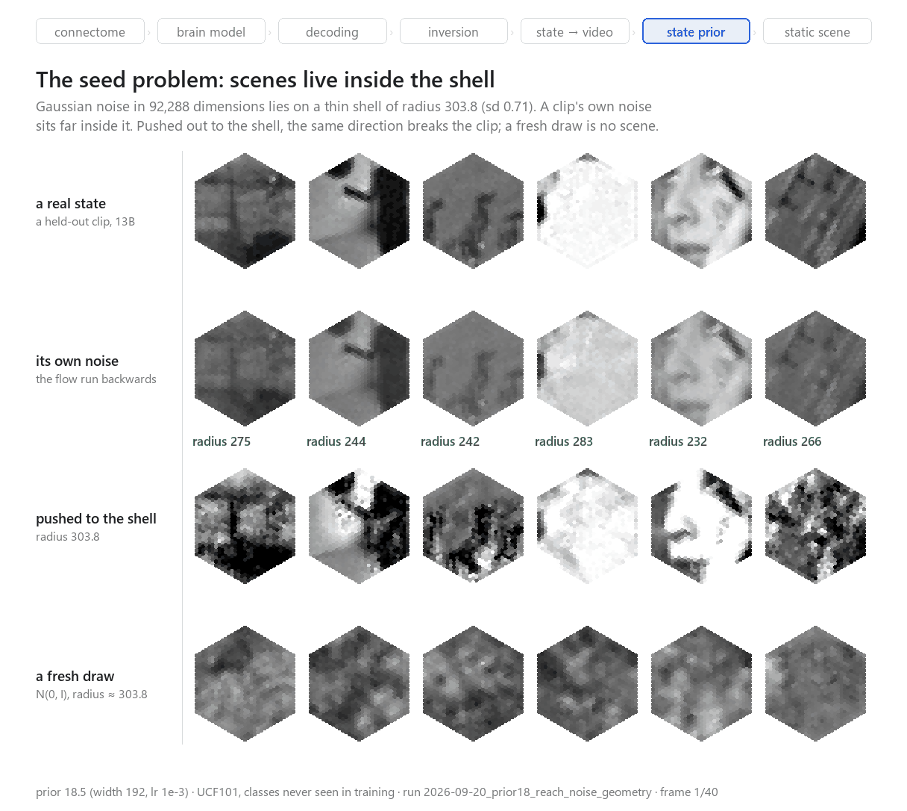
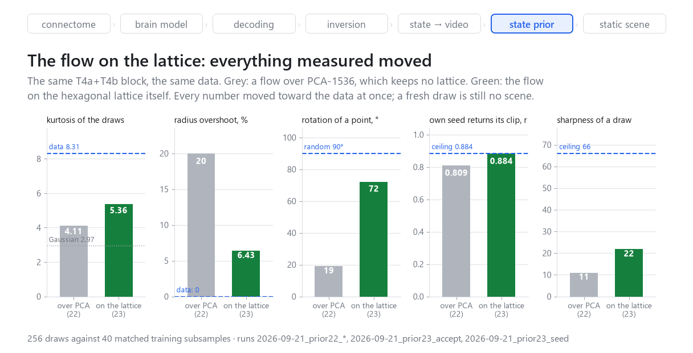
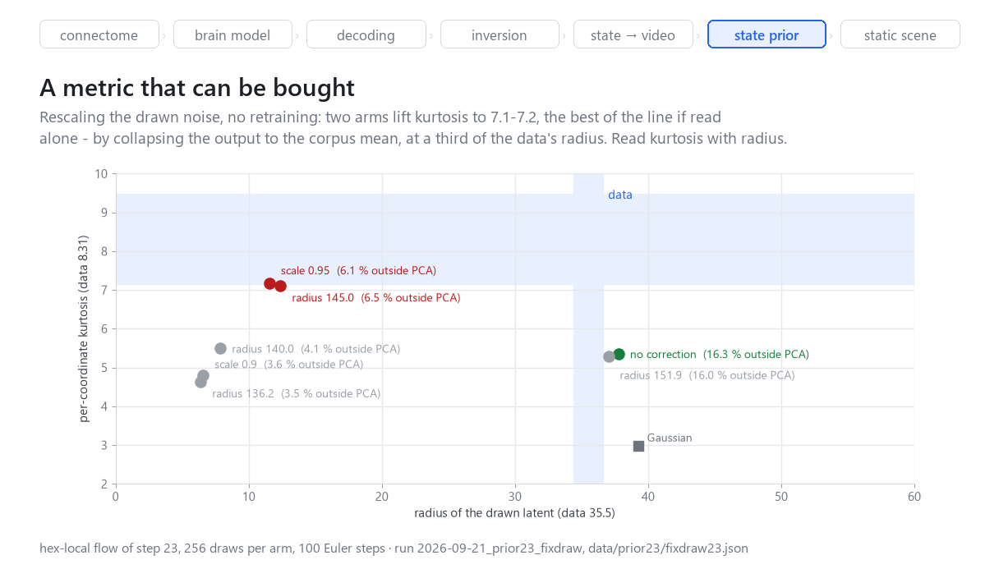
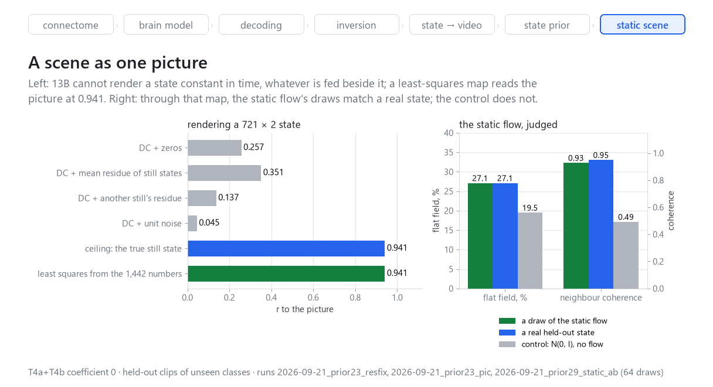

# Что снится мухе? Часть 2. От рендера состояния к генерации без исходного клипа

*Григорий Воякин, сентябрь 2026.* [English version](part2_en.md). Код, данные о запусках и все иллюстрации —
в репозитории [fly-brain](https://github.com/Grigoriy-V/fly-brain).
[Первая часть](part1_ru.md) кончается на шаге 14: цепочка
`видео → замороженный мозг → состояние T4/T5 → генератор → видео` работает и
измерена. Эта часть — о следующей задаче: **получить новое видео, у которого
нет исходного клипа**, через разыгранное состояние мозга. Текст о том, что
было построено, что измерено, что оказалось ложным и где мы стоим: в
генерируемых картинках появилась структура, а сцена пока не доказана.

Все числа взяты из `reports/runs.jsonl` и отчётов по шагам; где число не
подтверждено артефактом, это сказано прямо.

## Коротко

К концу первой части проект умел **отрисовать любое достижимое состояние
мозга** и не умел **придумать новое**. Для генерации без клипа нужен второй
генератор, выше по цепочке:

`ε ~ N(0, I) → noise2state → состояние → 13B → видео`

За четыре дня и примерно **$9,3** на Modal мы прошли путь от потока над
230 720 числами до потока над 1 442 числами на гексагональной решётке. По
дороге:

- выучили структуру состояний почти до уровня настоящих;
- нашли, что главный судья проекта **лгал**, и заменили его;
- дважды поймали собственные метрики на ошибке;
- сузили задачу с видео до **одной неподвижной картинки**.

Первый раз в этой линии розыгрыш не отделяется от настоящего состояния по двум
структурным судьям — доле ровного поля и соседней когерентности: в
генерируемых картинках появилась структура. Оговорки те же, что в § 11: судьи
смотрят через мыльный отрисовщик, а цель почти гауссова. Является ли эта
структура сценой, пока не доказано — для этого не хватает нормального
отрисовщика и метрики «это сцена».

**Граница утверждений прежняя.** Разыгранное состояние — не собственная
активность мозга мухи, а видео из него — не сон. Это видео, наиболее
совместимое с состоянием при данном энкодере. «Новое» — это измерение:
расстояние до ближайшего обучающего клипа рядом с тем же числом для
настоящего отложенного клипа.

## 1. Задача и критерий, который отменил все метрики

13B (часть 1, § 8) — условный поток «состояние → видео». Модели распределения
состояний `p(state)` у него нет, поэтому состояние можно было только снять с
видео. Задача второй части — выучить это распределение и разыгрывать из него.

Критерий приёмки главнее любой метрики: **результат засчитывается только
клипом против сырого видео корпуса.** Мыло на первой версии допустимо, если
появляются сцены и новый розыгрыш даёт новое осмысленное видео. Почему именно
так, рассказано в § 5: до этого критерия мы четыре раза подряд верили судье,
который ошибался.

## 2. Бесплатная база: что 13B делает без всякого условия

Прежде чем учить приор, мы спросили, не решена ли задача уже. 13B видел
«пустую» маску условия на 5 % шагов обучения, так что умеет рисовать из
одного шума. 16 таких видео локально, 35 секунд, $0.

Метрика новизны сначала проверена на себе: 13B, обусловленный состояниями
четырёх обучающих клипов, находит ближайшим **свой** клип в 4 случаях из 4
(r 0,94–0,99). То есть копирование она ловит.

| | из шума (16) | настоящие отложенные (16) |
|---|---|---|
| ближайшее обучающее видео, r (медиана) | +0,53 | +0,52 |
| смена кадра | 0,038 | 0,017 |

Видео новые в том же смысле, в каком нов настоящий отложенный клип, — и это
не сцены. Отсюда нужен приор.
[Отчёт 17.0](../../reports/2026-09-20_step17_0_unconditional_baseline.md).

## 3. Первый приор над состояниями: поток есть, многообразия нет

**17.1.** Flow matching прямо в пространстве состояний, по рецепту 13B:
токен — колонка (721), признаки — 40 кадров × 8 типов, 1,43 млн параметров.
Одна T4, 1 170 с, ≈ $0,23, загрузка карты 99,2 %.

Судья тогда — круговой ход: состояние → 13B → видео → мозг → состояние′.

| состояние, поданное в 13B | круговой ход |
|---|---|
| разыгранное из приора | **1,19** |
| настоящий отложенный клип | 0,004–0,061 |
| контроль: колонки клипа перемешаны | 1,77 |
| контроль: белый шум в типах | 2,19 |

Разыгранное состояние стоит рядом с перемешанным, а не с настоящим. Видео —
«соль с перцем». [Отчёт 17.1](../../reports/2026-09-20_step17_state_prior.md).

**17.1b.** Три четверти обучающих состояний 17.1 были от процедурных
стимулов, а задача — генератор видео. Приор переучен только на сценах, в
компактном временном базисе: DCT, 16 коэффициентов из 40, каждый z-нормирован
(92 288 чисел).
K = 16 выбран измерением, а не на глаз: на настоящем состоянии K = 8 даёт
круговой ход 0,58, K = 16 — 0,045, полное состояние — 0,019.

| | лаг 1 по времени | соседство по кольцу | связь типов | смена кадра видео |
|---|---|---|---|---|
| 17.1 | 0,57 | 0,34 | 0,16 | 0,280 |
| **17.1b** | **0,98** | **0,77** | **0,31** | **0,026** |
| настоящие | 0,99 | 0,80 | 0,35 | 0,057 |
| что даёт сам базис DCT-16 на белом шуме | 0,77 | −0,00 | 0,01 | — |

Последняя строка — контроль: базис сам по себе не создаёт ни пространственной
структуры, ни связи типов. Их выучила модель. Круговой ход упал в 8 раз, до
0,142, — но сцен нет, только ориентированная текстура и крупные движущиеся
пятна. [Отчёт 17.1b](../../reports/2026-09-20_step17_1b_scene_dct_prior.md).



*Рис. 1. Каждая клетка — видео 13B. Сверху — из состояния отложенного клипа;
ниже — из пустого условия 13B, из розыгрыша приора 17.1 и из розыгрыша 17.1b.
Скрипт `tools/fig_gh_part2.py`, запуски `2026-09-20_baseline17`,
`2026-09-20_prior17_*`.*

## 4. Поток, прогнанный назад: у каждого клипа есть свой шум

Приор — детерминированное отображение шума в состояние. Прогнав шаги Эйлера
назад, любому состоянию можно найти шум, из которого оно было бы разыграно.

Простой обратный шаг теряет четверть вектора (ошибка 0,243). **Четыре
итерации неподвижной точки** на шаг дают ошибку 0,0058 и r 0,99998 — обращение
точное. На этом стоит всё дальнейшее.

- Настоящий клип → его шум → обратно: состояние возвращается на r 0,964,
  лицо в клипе остаётся лицом.
- Шумы двух клипов не коррелируют (−0,013), хотя их состояния коррелируют на
  +0,48: приор декоррелирует то, что моделирует.
- Прообразы настоящих состояний лежат **чуть вне** типичного множества
  гауссова шума; перемешанное состояние — вчетверо дальше.



*Рис. 2. Сверху: клип A, 13B из его состояния, то же состояние через свой шум и
обратно, контроль с перемешанным состоянием. Снизу: прямая между шумами клипов
A и B; середина совпадает с полусуммой двух видео на r 0,85 — двойная
экспозиция. Скрипт `tools/fig_gh_part2.py`, данные `data/prior17/noise17_local`.*

[Отчёт 17.3b](../../reports/2026-09-20_step17_3b_noise_inversion.md).

## 5. Корпус обычного видео, рычаги обучения и судья, который лгал

**Корпус (18).** 19 сцен Sintel — мало. Собран корпус из UCF101: из 13 320
файлов фильтр прошли 12 411 клипов обычного видео, к ним 3 103 процедурных —
всего 15 514. Сплит **по классам**, так что проверка идёт на десяти классах,
которых обучение не видело. Глаз мухи для него — собственная
реализация цепочки FlyVis:

- проверена на кадрах Sintel против датасета самого FlyVis: **r = 1,000000**,
  максимальная разница 2,6e-4 (точность float16 кэша);
- линейная интерполяция времени вместо удержания кадров дала бы 0,998 — это
  не округление, а неверный временной закон, и мы его поймали;
- рендер глаза ускорен в **60 раз** (5,46 → 0,09 с на файл): вместо свёртки
  всего кадра 417×417 — бегущие суммы, прочитанные только в тех ~31 столбцах и
  ~61 строках, где есть рецептор. Весь корпус — за 9 минут вместо 57.

[Отчёт 18](../../reports/2026-09-20_step18_corpus_of_ordinary_video.md).

**Рычаги (18.3–18.5).** Шаг 18.4 прогнал семь плеч против одного контроля —
темп обучения, длина, ширина, число коэффициентов, условие по классам (рис. 3).
В таблице — только выигрышная цепочка:

| шаг | круговой ход |
|---|---|
| 17.1b, только Sintel | 0,142 |
| 18.3, корпус UCF101 | 0,095 |
| 18.4, ширина 192 | 0,034 |
| 18.5, ширина 192 + lr 1e-3 | **0,0224** |
| пол представления (настоящее состояние в DCT-16) | 0,0209 |

Все четыре прогноза, взятые из литературы, указали не туда; решающим рычагом
оказалась ширина. [Отчёты 18.3](../../reports/2026-09-20_step18_3_prior_on_the_corpus.md),
[18.4](../../reports/2026-09-20_step18_4_throughput_and_learning_rate.md),
[18.5](../../reports/2026-09-20_step18_5_width_and_the_representation_floor.md).

**И тут судья отказал.** Круговой ход дошёл до пола представления, а видео
оставались облаками. Разбор показал, что ворота ставили хорошие оценки
плохому:

- штрафовали контраст;
- уходили ниже пола представления;
- давали 0,0070 — лучше настоящего клипа — **почти пустому серому полю**;
- давали 0,0119, вровень с настоящим клипом, почти однородному градиенту.

Круговой ход измеряет совместимость видео с мозгом, а серое поле совместимо с
чем угодно. С этого дня ворота сняты с должности судьи, и действует критерий
§ 1: клип против сырого видео.



*Рис. 3. Слева: круговой ход всех плеч 18.3–18.5 рядом с полом представления.
Справа: почти пустое серое поле получает оценку лучше настоящего клипа.
Скрипт `tools/fig_gh_part2.py`, запуски `2026-09-20_prior18_*`.*

## 6. Проблема сида

Формулировка простая, и мы держали её неизменной: пока нельзя подать сид в
noise2state и получить видео, как на настоящем клипе, результата нет. Всё
исключённое по дороге записано [отдельно](../../reports/2026-09-20_the_seed_problem.md),
чтобы к нему не возвращаться.

| откуда шум | r к настоящему клипу |
|---|---|
| 13B прямо из настоящего состояния (потолок) | +0,969 |
| **прообраз этого клипа, заданный руками** | **+0,957** |
| обычный розыгрыш N(0, I) | −0,060 |

**Руками работает, розыгрышем — нет.** Причина — геометрия (рис. 4). Гауссов шум в
92 288 измерениях лежит на сфере радиуса 303,8 шириной 0,707, а прообразы
настоящих состояний — на 252,4, **на 73 стандартных отклонения внутрь**. Сида,
дающего сцену, не существует: сид индексирует розыгрыш на оболочке, а сцены не
на оболочке. Прибор проверен: состояние, разыгранное самим приором, обращается
назад ровно на оболочку.

Что пробовали и что исключено:

| что | результат |
|---|---|
| укоротить розыгрыш | хуже |
| закрепить за клипом произвольный шум | свой клип 0 раз из 8 |
| закрепить **собственный прообраз** клипа | 8 из 8 — выучилось, но не обобщается |
| minibatch-OT | пусто аналитически: от выбора пары зависит 0,33 % стоимости |
| условие по классам + guidance | структура хуже |
| больше шагов | чинит геометрию, картинку не трогает |
| больше ширины | двигает картинку, геометрию не трогает |

Две последние строки вместе значат: **геометрия прообраза и качество сэмпла —
две разные болезни.**



*Рис. 4. Шесть отложенных клипов из невиданных классов. Сверху вниз: 13B из
настоящего состояния; то же состояние из своего шума (радиус под клеткой: у
этого приора 232–283 при оболочке 303,8); тот же шум, вынесенный на оболочку
√D; обычный розыгрыш. Приор 18.5, скрипт
`tools/fig_gh_part2.py`, запуск `2026-09-20_prior18_reach_noise_geometry`.*

**VAE.** Член KL — ровно то, чего нет во flow matching: он смотрит, куда
кодируются настоящие данные. VAE по колонкам, латент 721 × 3.
- Половина «сид разыгрывается» **взята впервые**: латент отложенных клипов на
  радиусе 46,1 ± 1,99 при √D = 46,5.
- Половина «из разыгранного — сцена» не взята. Решающий тест с выключенным KL
  показал, что дело не в балансе: из чистого кода VAE даёт 0,687, а **обычная
  PCA той же размерности — 0,890**. Проигрыш не трансформеру, а линейной
  алгебре.

## 7. Линейная первая ступень и что она показала

**19.** PCA на 2 048 компонент по всем 13 555 обучающим состояниям, с
отбеливанием, а поток — над её латентом. Разложение через матрицу Грама
13 555 × 13 555 прямо на карте: 43 секунды на T4, **$0,02**; `eigh` занял 21 с
вместо ожидавшихся минут. [Отчёт 19](../../reports/2026-09-21_step19_linear_first_stage.md).

**20.** Перелёт сэмплера — не постоянный множитель, а **перекос во времени**:
поле скорости составляет 0,07 от истинного при t = 0,4 и около 2,5 при
t = 0,6–0,8.
Поэтому исправления из литературы с постоянным делителем его не берут. Проекция
на измеренную траекторию чинит геометрию и улучшает ворота в 2,2 раза — **и
сцены не даёт**. Второй раз выигрыш в геометрии оказался не выигрышем
генератора. [Отчёт 20](../../reports/2026-09-21_step20_sampler_and_cuts.md).

**21c–21d.** Два полезных свойства цепочки:
- **Цепочка восстанавливает выброшенное.** Половина состояния, обнулённая и
  прогнанная через `состояние → 13B → видео → мозг` с честной маской типов
  (следующий пункт), возвращается с ошибкой 0,0433 против 0,5581 до цепочки —
  в 12,9 раза меньше. Первый замер через полную маску давал 0,0846 и
  недооценивал эффект. [Отчёт](../../reports/2026-09-21_state_restoration.md).
- **У 13B есть маска типов, и ею надо пользоваться честно.** Все прогоны до
  этого подавали полную маску над обнулённой половиной, то есть говорили
  модели «тип есть и он ровный». С честной маской один T4 даёт r 0,904 против
  0,837 у дополнения через PCA.

## 8. Меньший объект — и ничего не сдвинулось

**22.** Если задача трудна, можно уменьшить объект. Внутри T4:
- пространство резать нельзя: поле зрения с 721 до 127 колонок роняет
  корреляцию к сырому видео по всему кадру с 0,904 до 0,238 (первое прочтение
  «0,011 потерь» считалось только по оставшейся зоне и было ошибкой);
- время резать дорого: половина временных коэффициентов при том же числе
  координат даёт 0,444 против 0,721;
- четыре направления T4 неравны, и горизонтальная пара **T4a+T4b** несёт почти
  всё: 0,884 против 0,904 у всех четырёх, при вдвое меньшем числе чисел.

С этого шага объект — блок T4a+T4b, 721 колонка × 32 канала = 23 072 числа.
Лестница PCA над ним плоская (0,806 на 1 536 компонентах против 0,824 на
2 048). Три обхода PCA — сжатие каналов, обучаемый локальный остаток,
автоэнкодер блока — проиграли ей на сравнимом бюджете. Поток над 1 536
координатами обучен за $0,05; свежий розыгрыш по-прежнему не сцена.
[Отчёт 22](../../reports/2026-09-21_step22_a_smaller_object.md).

## 9. Аудит метрик до следующего обучения

После того как один судья уже оказался ложным, мы остановили обучение и
перепроверили каждую метрику: что она мерит, какой у неё пол и не считается ли
она на не том распределении. [Отчёт](../../reports/2026-09-21_the_draw_distribution.md).

**Поток выучил второй момент распределения, но не четвёртый.** Разброс радиуса
у розыгрышей почти правильный, а покоординатный эксцесс — 4,11 против
8,31 ± 1,17 на подвыборках обучающих данных того же размера (у гаусса 2,97).
Данные тяжелохвостые и разреженные, розыгрыши — почти гауссовы.

**Поток почти не поворачивает точку**: 19° там, где у случайного поворота 90°.
Отображение близко к тождественному. Отсюда наблюдение, что
интерполяция между двумя клипами выглядит как двойная экспозиция: в почти
линейном отображении «между» значит «полусумма».

**Каждому судье — его пол:**

| судья | пол | что это значит |
|---|---|---|
| r розыгрыша к сырому видео | 0,002 ± 0,100 между двумя разными настоящими клипами | прежнее 0,017 никогда не было доводом |
| ближайший обучающий клип | 0,521 у настоящего отложенного | «не копия» — верно и слабо |
| резкость, шкала «шум = 0, сырое видео = 100» | потолок отрисовщика около 66 для блока T4a+T4b | свежий розыгрыш — 11 |

Попутно найдено: в одном скрипте розыгрыши сравнивались не с обучающим
латентом, а с тестовым (ISS-0010); из-за этого перелёт радиуса читался как 44 %
там, где он 20 %. Три функции с одним именем `nearest` считали разное
(ISS-0011).

## 10. Поток на решётке: сдвинулось всё, что мерилось

Вывод аудита и шага 22 один: **линейная первая ступень уничтожает геометрию.**
Координата PCA — глобальная мода по всем колонкам, соседство в ней не
выражается, и локальную архитектуру поверх неё не построить. При этом
ковариация состояния локальна: 0,876 на одном шаге решётки против 0,267 у
перемешанного контроля.

**23.** Поток работает прямо на блоке 721 × 32, решётка цела, PCA нет
([отчёт](../../reports/2026-09-21_step23_hex_local_prior.md), код
`flydream/generate/hexflow23.py`):

| элемент | решение |
|---|---|
| токен | патч из трёх соседних колонок по подрешётке √3×√3 |
| разбиение | паросочетание Куна: **239 патчей ровно по 3 колонки и 2 по 2** |
| внимание | локальная маска, 7 соседей |
| позиция | общая таблица относительного смещения, без абсолютной позиции |
| глобальная связь | 4 регистровых токена |

Почему паросочетание, а не ближайший центр: наивное назначение даёт патчи от
1 до 5 колонок, токены получают разный вес, и эквивариантность, ради которой
всё строилось, ломается.

Обучение: 12 000 шагов, батч 256, lr поднят вдесятеро (2e-4 → 2e-3) после
бесплатной локальной пробы, **загрузка T4 99,9 %** против 37,4 % у прошлого
прогона, 3 047 с, **$0,51**.

| | поток над PCA (22) | **поток на решётке (23)** | данные |
|---|---|---|---|
| эксцесс | 4,11 | **5,36** | 8,31 ± 1,17 |
| путь от шума к данным | 21 % | **45 %** | — |
| перелёт радиуса | 20 % | **6,4 %** | — |
| поворот | 19° | **72°** | 90° у случайного |
| свой сид клипа возвращает клип | 0,809 | **0,884 = потолок** | — |
| резкость розыгрыша (шум 0 / видео 100) | 11 | **22** | потолок 66 |

Двойной экспозиции больше нет. Свой сид возвращает свой клип ровно на
потолке, потому что между заказом и ответом не осталось теряющей ступени.
Сцены — нет.



*Рис. 5. Тот же блок T4a+T4b и те же данные: поток над PCA-1536 (серый) и
поток на гексрешётке (зелёный), рядом ориентир данных или потолка. Скрипт
`tools/fig_gh_part2.py`, запуски `2026-09-21_prior22_*`,
`2026-09-21_prior23_accept`, `2026-09-21_prior23_seed`.*


*Рис. 6. Поток на решётке. Сверху — отложенные клипы из невиданных классов;
в середине — их собственные сиды, прогнанные вперёд через поток и 13B;
снизу — случайные сиды. Скрипт `tools/fig_gh_seed.py`, запуск
`2026-09-21_prior23_seed`.*

**26 — поправки в момент розыгрыша, и метрика оказалась покупаемой.** Семь
плеч над радиусом разыгрываемого шума, локально, $0. Два плеча
подняли эксцесс до 7,11 и 7,17 — лучший результат линии, если читать его в
одиночку. Но радиус выхода у них упал втрое **ниже** данных (12,4 и 11,6 против
35,5), а энергия вне PCA — с 16,3 до 6,5 и 6,1 %. Выход схлопнулся к среднему
корпуса, а эксцесс механически растёт, когда большинство координат сидит на
нуле. Правило, которое пережило шаг: **эксцесс всегда читается рядом с
радиусом.** [Отчёт 26](../../reports/2026-09-21_step26_corrections_at_draw_time.md).



*Рис. 7. Семь плеч шага 26 в осях «радиус — эксцесс»; полосы — диапазон
данных. Красные плечи подняли эксцесс, уронив радиус. Скрипт
`tools/fig_gh_part2.py`, данные `data/prior23/fixdraw23.json`.*

## 11. Поворот к статике: сцена одной картинкой

Задача сужена: сцена не видео, а одна неподвижная картинка, движение пока
неважно. Объект — **721 × 2** (нулевой временной коэффициент блока), а не
721 × 32: смысл сужения в том, чтобы убрать из задачи время целиком, а не
уменьшить его. Ставка не на размер объекта — шаг 22 показал, что размер
ничего не покупает, — а на то, что из задачи уходит целый фактор вариации.
[Отчёт 29](../../reports/2026-09-21_step29_a_scene_as_one_picture.md).

**Есть ли в этом пространстве неподвижная картинка вообще.** Проверяется
сменой стимула: один кадр, удержанный всё окно, проходит
`стимул → мозг → состояние → 13B` с **r 0,953**, лучше, чем движущийся клип
(0,916), и отрисовка действительно неподвижна. Довод «T4/T5 — детекторы
движения, значит статики нет» ложен.

**13B не может отрисовать постоянное во времени состояние**, и ни один костыль
это не спасает:

| что подано в 13B вместе с 721 × 2 | r к картинке |
|---|---|
| нули в остальных коэффициентах | 0,257 |
| средний остаток неподвижных состояний | 0,351 |
| остаток **другой** неподвижной картинки | 0,137 |
| единичный шум | 0,045 |
| потолок: настоящее неподвижное состояние | 0,941 |

Самое информативное плечо — третье: 13B рисует резкую картинку, но картинку
**донора**. Содержание, которое читает 13B, живёт во временных коэффициентах,
хотя энергии в них всего 4 %.



*Рис. 8. Слева: что 13B делает с состоянием 721 × 2 при каждом костыле и что
даёт матрица наименьших квадратов. Справа: розыгрыши статического потока
через эту матрицу рядом с настоящим состоянием и контролем без потока.
Скрипт `tools/fig_gh_part2.py`, запуски `2026-09-21_prior23_resfix`,
`2026-09-21_prior23_pic`, `2026-09-21_prior29_static_ab`.*

**Но картинка в статике есть, и она линейна.** Матрица наименьших квадратов из
1 442 чисел в среднее кадров окна даёт **r 0,941** на отложенных клипах
невиданных классов; контроли — 0,021 (среднее корпуса) и 0,002 (перемешанные
пары). Резкости МНК не даёт и дать не может: она рисует условное среднее по
всем картинкам, совместимым с состоянием, — 27,1 % ровного поля против 39,2 %
у цели.

**29 — поток над статическим состоянием.** Обучен на нулевом коэффициенте DCT
уже снятых состояний, без единой новой симуляции мозга. 10 000 шагов, батч
256, 2 512 с, загрузка T4 99,0 %, **$0,42**. Судьи — через ту же матрицу МНК,
64 розыгрыша:

| | розыгрыш | настоящее состояние | контроль: N(0, I) без потока |
|---|---|---|---|
| доля ровного поля | **27,1 %** | 27,1 % | 19,5 % |
| соседняя когерентность | **0,928** | 0,949 | 0,492 |
| контраст | 0,128 | 0,181 | — |
| ближайшая обучающая картинка | 0,753 | 0,706 | — |

**Первый раз в этой линии розыгрыш не отличается от настоящего состояния по
двум структурным судьям**, а контроль отличается грубо. Ровно настолько и не
шире: по контрасту недолёт 29 %, и розыгрыш лежит к обучающему корпусу ближе,
чем настоящее отложенное состояние.

Две границы, без которых это читать нельзя:
- отрисовщик мылит, и совпасть с настоящим состоянием **через него** — гораздо
  более низкая планка, чем быть сценой;
- цель почти гауссова: среднее по 40 кадрам тянется к нормальности (эксцесс
  3,17 против 2,98 у гаусса), так что судья-эксцесс здесь пустой.

Второе подсказывает следующий шаг: **один временной срез** состояния
разреженнее среднего (эксцесс 5,26 против 3,17) и отрисовывается в свой кадр
на r 0,88–0,96 с 5-го по 35-й кадр; нулевой кадр сломан — это артефакт края
окна. Оговорка: эти числа сняты разовым скриптом, который не сохранился, и
ещё не перепроверены кодом из репозитория; это первый пункт следующего шага.

**Визуальная оценка** даёт то же, что таблица, и не больше: формы ближе к
сцене, чем всё, что было до, но по картинкам, прошедшим мыльный отрисовщик,
нельзя сказать, хорош поток или плох. Даже настоящее состояние через него
узнаётся с трудом.


*Рис. 9. Сверху — картинки шести отложенных клипов (среднее кадров окна),
выбранные на глаз как узнаваемые; в середине — их настоящие статические
состояния через матрицу наименьших квадратов; снизу — первые шесть розыгрышей
статического потока, не отобранные, через ту же матрицу. Числа на рисунке
посчитаны на этих шести клипах, матрицей, переобученной скриптом (r 0,939
вместо 0,941), и по локальной реконструкции состояний, поэтому они немного
отличаются от таблицы выше (ровное поле 25,3 % вместо 27,1 %); таблица —
запись прогона на 64 розыгрышах. Скрипт `tools/fig_gh_static.py`.*

## 12. Инженерия второй части

Сквозная линия этой части — как делать много дешёвых экспериментов на одной
T4 и не платить за простой.

| решение | что дало |
|---|---|
| **правило «GPU на 100 %»**: независимые задачи в одну batch-ось | 98–99,9 % загрузки T4 в каждом обучении; 37,4 → 99,9 % на шаге 23 |
| **минимальный запрос контейнера**: cpu 1 / 12 ГБ при T4 | ядро ≈ $0,19/ч и гигабайт ≈ $0,024/ч против $0,59/ч за саму карту; цена прогона $0,05–0,51 |
| **GPU-функция делает только GPU-работу** | рендер и сборка данных — на CPU или локально; карта стартует с готового файла на томе |
| **профилирование вместо догадки** (18.4a) | гипотеза «упираемся в запуск ядер» опровергнута: 2,44 мс фиксированной части на шаг из 54,7; `torch.compile` дал 54,7 → 38,5 мс |
| **свой рендер глаза** | 60× быстрее, совпадает с FlyVis на r 1,000000 (разница не больше 2,6e-4 — точность float16-кэша) |
| **DCT-16 и z-нормировка по коэффициентам** | 230 720 → 92 288 чисел на состояние при 99,55 % энергии; колено выбрано измерением |
| **PCA через матрицу Грама на карте** | 43 с и $0,02 вместо оценённых минут |
| **обращение потока неподвижной точкой** | ошибка 0,243 → 0,0058 при 4 вызовах модели на шаг |
| **патчинг гексрешётки паросочетанием Куна** | равные токены, эквивариантность без абсолютной позиции |
| **маска типов 13B как родной вход** | «тип не задан» вместо «тип нулевой»; 0,837 → 0,904 |

Вся вторая часть на Modal — около **$9,3**; всё судейство, все фигуры и
большая часть экспериментов — локально на CPU, бесплатно.

## 13. Ошибки, пойманные по дороге

Для ML-инженера эта глава, возможно, полезнее результатов. Каждую ошибку мы
записали в [ISSUES](../../ISSUES.md) или в отчёт шага.

- **Ворота лгали** (§ 5): совместимость с мозгом не есть сцена, серое поле
  совместимо со всем.
- **Сравнение не с тем распределением** (ISS-0010): розыгрыши сверялись с
  тестовым латентом вместо обучающего, перелёт 20 % читался как 44 %.
- **Три функции `nearest`** с разной математикой под одним именем (ISS-0011).
- **Шум в 13B был общим на батч** (ISS-0009): клетки одной фигуры рисовались
  не с одним z, и интерполяция показывала провал, который отчасти был её
  собственным артефактом.
- **Неравные патчи** (23): первая версия разбиения ломала эквивариантность.
- **Отображение съедало контраст** (ISS-0012): сетки картинок нормировали каждую
  клетку к одному среднему и разбросу, выравнивая ровно тот контраст, который
  подписи сравнивали: высококонтрастный клип выглядел серым.
- **Пересчёт чисел в отчётах из артефактов**: девять расхождений, среди них
  «lr поднят впятеро» вместо вдесятеро, число без артефакта (15,8 % вместо
  16,3 %) и два перебора в пользу результата. Все исправлены с пометкой.

Общий урок: **сводная статистика шесть раз разошлась с картинкой**, и каждый
раз права была картинка. Поэтому у каждого судьи теперь есть пол, у каждого
результата — контроль из того же прогона, а последнее слово — за визуальной
оценкой против сырого видео.

## 14. Где мы сейчас

**В структуре генерируемых изображений большой сдвиг.** Розыгрыши статического
потока совпадают с настоящими состояниями по доле ровного поля и соседней
когерентности, контроль без потока отделяется грубо, разнообразие в диапазоне
данных. Структура, которой не было ни у одного предыдущего генератора линии,
появилась. Косвенные метрики сдвинулись в нужную сторону все сразу.

**Сцена не доказана — по трём причинам, и ни одна из них не «не получилось»:**

1. **Нет нормального отрисовщика.** Картинка сейчас получается матрицей
   наименьших квадратов, а она рисует условное среднее и мылит по построению.
   Через неё даже настоящее состояние узнаётся с трудом, так что судить о
   сцене по ней нельзя. Нужен порождающий отрисовщик «состояние → картинка»,
   проверенный сначала на настоящих состояниях против настоящих кадров.
2. **Нет метрики «это сцена».** Все судьи линии — структурные и косвенные:
   доля ровного поля, когерентность, эксцесс, радиус, ближайший обучающий.
   Ни один не отвечает на вопрос, осмысленна ли картинка. Для этого нужен
   eval из традиционной генерации изображений — FID/KID-подобное сравнение
   распределений и precision/recall по признакам предобученной сети, —
   посчитанный на отрисовках рядом с тем же числом для настоящих состояний.
3. **Это первый тест генерации статики.** Один прогон, 10 000 шагов, $0,42,
   цель — среднее по окну, которое тянется к гауссу. Узким местом могут быть
   данные (восемь временных срезов на клип дают восьмикратный корпус без новой
   симуляции и негауссову цель) или архитектура (ширина, глубина, длина
   обучения); ни то ни другое ещё не варьировалось.

Есть также набор судей с измеренными полами и известными способами обмана,
поток на гексрешётке, который переносится с видео на статику без изменений, и
ясный порядок: перемерить кодом два числа, на которых стоит статика; обучить
отрисовщик; добавить eval сцены; затем поток на временных срезах.

## Воспроизведение

Все иллюстрации лежат в [`docs/figures/`](../figures/) и собираются
локально скриптами из `tools/` по сохранённым запускам:

```bash
uv run python tools/fig_gh_part2.py      # рис. 1-5, 7, 8
uv run python tools/fig_gh_seed.py       # рис. 6
uv run python tools/fig_gh_static.py     # рис. 9
```

Каждое число статьи ведёт к отчёту шага в `reports/` и к записи в
[`reports/runs.jsonl`](../../reports/runs.jsonl) с идентификатором запуска; известные
дефекты — в [`ISSUES.md`](../../ISSUES.md).

## Литература

- Lipman Y. et al. Flow matching for generative modeling. *ICLR* (2023). —
  обучение приоров над состояниями.
- Ma N. et al. SiT: Exploring flow and diffusion-based generative models with
  scalable interpolant transformers. *ECCV* (2024). — генератор 13B.
- Kingma D. P., Welling M. Auto-encoding variational Bayes. *ICLR* (2014). —
  VAE в § 6.
- Tong A. et al. Improving and generalizing flow-based generative models with
  minibatch optimal transport. *TMLR* (2024). — minibatch-OT в § 6.
- Ho J., Salimans T. Classifier-free diffusion guidance. arXiv:2207.12598
  (2022). — условие по классам и guidance в § 6.
- Kuhn H. W. The Hungarian method for the assignment problem. *Naval Research
  Logistics Quarterly* 2, 83–97 (1955). — разбиение решётки на патчи в § 10.
- Heusel M. et al. GANs trained by a two time-scale update rule converge to a
  local Nash equilibrium. *NeurIPS* (2017). — FID, § 14.
- Kynkäänniemi T. et al. Improved precision and recall metric for assessing
  generative models. *NeurIPS* (2019). — precision/recall, § 14.
- Soomro K., Zamir A. R., Shah M. UCF101: A dataset of 101 human actions
  classes from videos in the wild. arXiv:1212.0402 (2012). — корпус § 5.
- Lappalainen J. K. et al. Connectome-constrained networks predict neural
  activity across the fly visual system. *Nature* 634, 1132–1140 (2024). —
  модель зрительной доли, её глаз и Sintel-данные.
