# Что снится мухе? Часть 1. От коннектома MaleCNS до видео из состояния мозга

*Григорий Воякин, сентябрь 2026.* [English version](2026-09-19_article_part1_en.md). Код, данные о запусках и все иллюстрации —
в репозитории [fly-brain](https://github.com/Grigoriy-V/fly-brain). Вторая
часть — [генерация без исходного клипа](2026-09-23_master_article_part2_draft.md).

## Коротко о проекте

Два вопроса: как видеосигнал проходит через зрительную систему мухи и можно ли
по состоянию этой системы **создать видео**. Чтобы ответить, мы:

- перенесли проводку **правой зрительной доли** коннектома MaleCNS в сетевую
  архитектуру FlyVis и запустили на ней динамику с параметрами FlyVis;
- сняли ответы модели на разных уровнях зрительного пути;
- построили четыре способа вернуться от активности к видео: линейное чтение,
  оптимизацию входа через замороженную модель, быструю свёрточную сеть и
  условную генеративную модель (SiT).

```
видео → глаз (721 гексагональная колонка) → модель доли на проводке MaleCNS
      → состояние уровня (R, L, Mi/Tm, T4/T5)
      → линейное чтение / инверсия входа / CNN / SiT → видео
      → повторный прогон через ту же модель
```

**Что здесь нового для ML-инженера:**

1. экспорт коннектома в фильтры по гексагональной решётке с явной геометрией
   колонок и перенос обученных параметров на чужую проводку — вместе с ошибкой
   переноса, которую пришлось найти;
2. карта декодируемости по уровням, в которой контроли дважды опрокинули
   красивый вывод;
3. инверсия видео через замороженную рекуррентную сеть и её пакетное ускорение;
4. условный поток «состояние мозга → видео» и проверка того, где он
   подчиняется условию, а где нет.

**Граница утверждений.** Это модель, ограниченная проводкой MaleCNS, а не
симуляция всей нервной системы и не запись мозга живой мухи. Видео,
восстановленное из состояния, — это стимул, наиболее совместимый с этим
состоянием в этой модели, а не то, что видит муха. «Сон» в названии — вопрос
проекта, а не результат.

**Одна мера на всю статью.** Любое видео, полученное из состояния, можно снова
прогнать через ту же замороженную модель и сравнить полученное состояние с
заданным. Эту ошибку мы называем **круговым ходом**: чем она меньше, тем лучше
видео совместимо с состоянием. Круговой ход мерит совместимость, а не
содержание, и ниже есть случаи, где он обманывает (§ 8, § 9).

## 1. Два описания мозга пришлось сделать совместимыми

MaleCNS даёт связи между отдельными нейронами; FlyVis — готовую динамическую
архитектуру, набор типов и обученные параметры. Перенести «коннектом в FlyVis»
значило не вставить таблицу весов, а согласовать имена типов, гексагональные
координаты колонок, направление осей, знаки и масштаб входов.

- **Типы:** для 61 из 65 узловых типов FlyVis найдено соответствие в MaleCNS.
- **Колонки:** домашняя колонка нейрона определялась по положению его синапсов.
  На 13 267 размеченных клетках 15 типов она совпала с тегом MaleCNS в 96,9 %
  случаев.
- **Фильтры:** соединения агрегированы в `тип-источник → тип-цель → смещение
  колонок`, формат, который читает FlyVis.
- **Плотность:** типы, у которых клеток меньше, чем колонок, получили
  разреженный шаг решётки по своей плотности. Без этого широкопольный TmY4
  стоял бы в каждой колонке, получал бы втрое больше соседей, чем в реальности,
  и петля TmY4 → TmY5a → T2a разгоняла сеть до 10⁸.

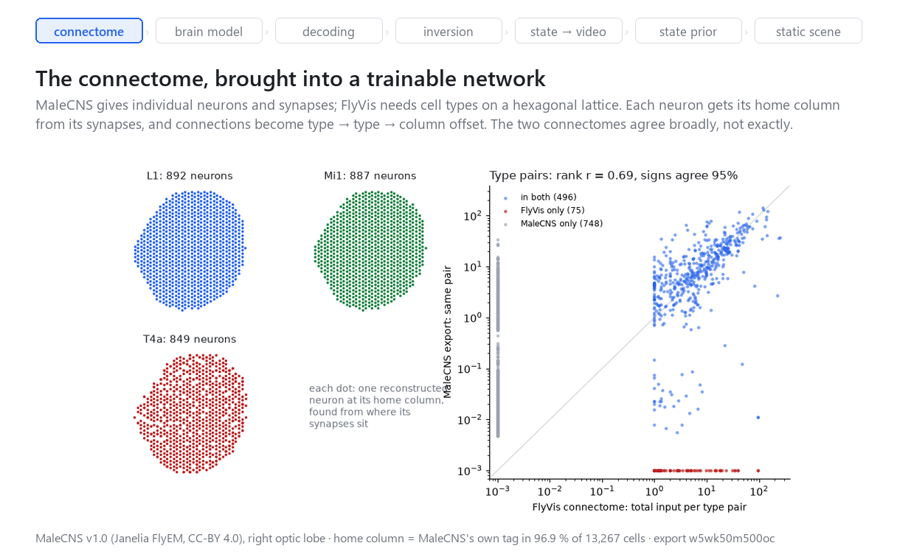

*Рис. 1. Слева: реконструированные нейроны MaleCNS трёх колончатых типов,
поставленные в свои домашние колонки. Справа: суммарный вход каждой пары
типов в коннектоме FlyVis против той же пары в экспорте MaleCNS; пары,
которые есть только в одном коннектоме, лежат на осях. Скрипт
`tools/fig_gh_connectome.py`.*

Различия между коннектомами при этом никуда не делись. Из 571 пары типов
FlyVis в экспорте есть 496 (0,869). Ранговая корреляция их суммарных весов на
первом экспорте — 0,752, на текущем — 0,69; знаки совпадают в 95 % пар.
Отсутствующие клетки и пути — прежде всего CT1 и часть ламины — остались
известными пробелами реконструкции.

Экспорт потом менялся дважды: слабые пары получили отдельное правило, а выходы
штатной задачи FlyVis ограничены типами с колончатой картой. **Текущая
модель:** 60 типов, 31 526 узлов на 721 колонке, 1,35 млн рёбер. Узлы — это
клетки модели на решётке, а не реконструированные нейроны: в самой правой доле
MaleCNS их 51 875. [Отчёт о данных](2026-09-18_step1_data.md).

## 2. «Модель ноль»: динамика заработала, а валидация нашла нашу ошибку

Параметры FlyVis перенесены по типам клеток и парам типов на проводку MaleCNS.
Проверка — штатные протоколы FlyVis на трёх членах её ансамбля: полярность
ответа на вспышку и направленная избирательность (DSI) детекторов движения
T4/T5 на движущемся крае.

Первая версия сохраняла полярность ON/OFF, но избирательность T4/T5 была почти
нулевой: **DSI 0,020 против 0,391 у FlyVis.** Причина нашлась в нашем же
переносе: `syn_strength` в FlyVis — это усиление, делённое на число синапсов в
*его* коннектоме. Простое копирование коэффициента на MaleCNS недооценивало
главный вход T5 и переоценивало его торможение.

| версия | что изменено | DSI, члены 000 / 001 / 002 | средний DSI | средняя ошибка направления |
|---|---|---|---|---|
| v5 | прямое копирование | 0,034 / 0,026 / 0,000 | 0,020 | 29,9° |
| v7 | усиление пересчитано по суммарному входу пары, коэффициент ограничен | 0,101 / 0,150 / 0,075 | 0,109 | 18,0° |
| **v9 (текущая)** | плюс исключение для слабых пар в экспорте | 0,200 / 0,191 / 0,065 | **0,152** | 39,2° |
| FlyVis, те же члены | — | 0,547 / 0,344 / 0,281 | 0,391 | 31,7° |

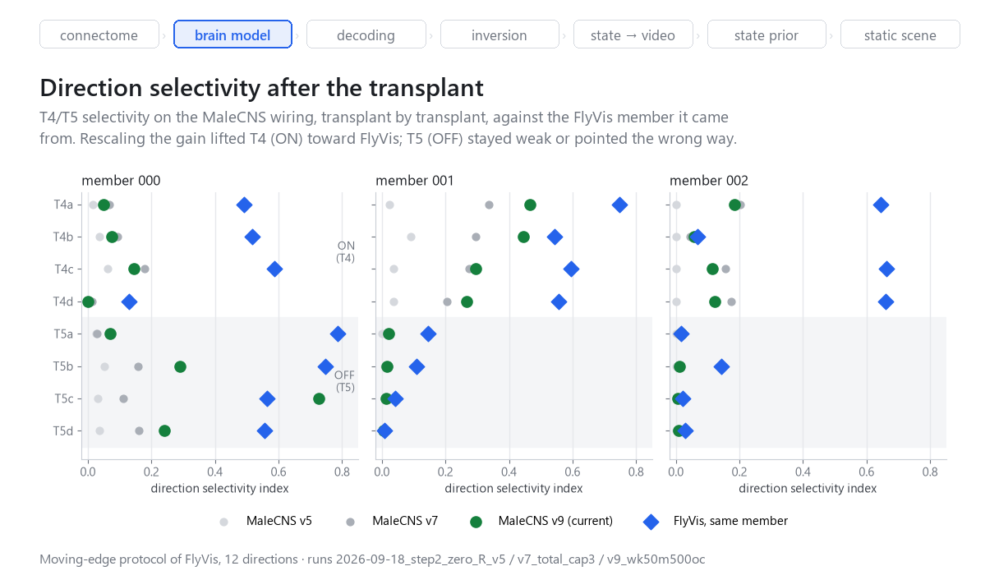

*Рис. 2. Направленная избирательность T4/T5 на проводке MaleCNS по версиям
переноса рядом с тем членом FlyVis, с которого перенесены параметры. Скрипт
`tools/fig_gh_charts.py`, запуски `2026-09-18_step2_zero_R_*`.*

Все три члена устойчивы, полярность вспышки сохранена (0,922 против 0,906 у
FlyVis). По сравнению с v7 текущая версия — размен: избирательность выросла на
40 %, средняя ошибка предпочтительного направления — вдвое.

**Путь ON перенёсся, путь OFF — нет.** На лучшем члене 001 четыре подтипа T4
дают DSI 0,37 против 0,61 у FlyVis и ошибку направления 5,5° против 9,8°. T5 на
членах 001 и 002 почти не избирательны (DSI 0,006–0,020), а на члене 000
избирательны, но смотрят на 49–144° мимо известного направления; среднюю
ошибку делают именно они. Стоит оговорить, что и у FlyVis на членах 001 и 002
T5 заметно слабее T4.

**Дефект пути OFF виден и глазом.** Когда мы нарисовали активность каждого
типа рядом с той же сетью FlyVis, оказалось, что L3 в модели ноль — правильная
решётка отдельных сильно гиперполяризованных клеток на почти ровном поле,
Tm9 и T5a несут периодические диагональные полосы, а Tm1 отвечает с обратным
знаком. Путь ON (R1, L1, Mi1) совпадает с FlyVis. Вспышка этого не видит:
полному полю пространственный узор безразличен. Причина не установлена;
кандидаты — разреженный шаг решётки из § 1, неполная ламина, ограниченные
коэффициенты переноса на парах ламины, знаки входов Tm1. Все состояния,
с которыми работают генераторы ниже и во второй части, сняты с этой модели,
так что T5 в них несёт этот дефект
([ISS-0015](../ISSUES.md)).

Урок: DSI 0,020 нельзя было выдавать за свойство коннектома MaleCNS — по
меньшей мере отчасти это была ошибка масштабирования при переносе, а то, что
осталось, частично объясняется дефектом, найденным только картинкой.
[Отчёт шага 2](2026-09-18_step2_model_zero.md) (таблица v7 и v9 по подтипам —
в его § 7), причина первой ошибки — ISS-0003 в [ISSUES](../ISSUES.md).

## 3. Что можно прочитать обратно из разных уровней


*Рис. 3. Как выглядят уровни: активность восьми типов клеток на решётке из 721
колонки, пока глаз смотрит клип Sintel. Красный — деполяризация, синий —
гиперполяризация. Здесь эталонная сеть FlyVis (член 000): её путь OFF чистый,
и именно с ней модель ноль сравнивается в § 2. Скрипт
`tools/fig_gh_layers.py`.*

Мы снимали активность фоторецепторов, ламины, медуллы и детекторов движения
T4/T5. Первый инструмент — ridge-регрессия по типам клеток: яркость 721 колонки
из активности одного типа, рядом контроли с нарушенным соответствием активности
и кадра.

**Первый протокол мерил не то.** На простом движущемся крае контроль с
перестановкой условий дал 0,903 при 0,902 у правильных пар: протокол мерил
повторяемость стимула, а не информацию в состоянии. Мы перешли на Sintel,
разбитый по сценам, и собрали гексагональный свёрточный декодер.

**Вторая «лестница» тоже не стала выводом.** Кривая «от сетчатки вглубь
информация теряется» оказалась свойством окна декодера. На лучшем члене
ансамбля FlyVis скорректированная на контроль корреляция T5a растёт с 0,057 при
нулевом лаге до 0,625 при окне из лагов 0, 2, 4 кадра — и порядок уровней
переворачивается. Само это окно оказалось с артефактом: разреженные лаги
попадают в одну фазу удержания кадра Sintel (24 кадра в секунду, поднятые до
50), и реконструкция чередуется от кадра к кадру. На соседних лагах 0, 1 тот же
T5a даёт 0,495.

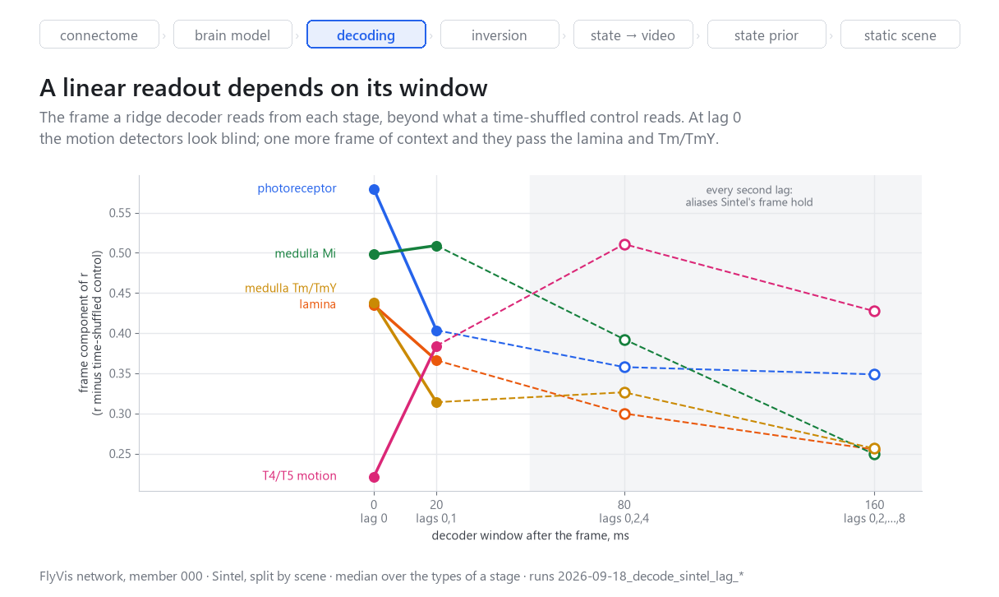

*Рис. 4. Сколько кадра читает линейный декодер из каждой стадии сверх
контроля с перемешанным временем, в зависимости от окна. Сеть FlyVis, член
000; окна из лагов через кадр (80 и 160 мс) попадают на артефакт удержания
кадра и показаны пустыми точками. Скрипт `tools/fig_gh_charts.py`.*

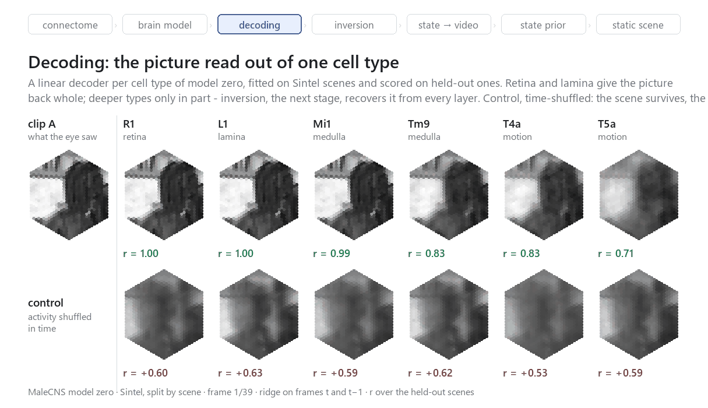

*Рис. 5. Линейное чтение модели ноль: ridge-декодер на каждый тип по кадрам t и
t−1, обучен на сценах Sintel, r посчитан на отложенных сценах. Нижний ряд —
контроль: тот же декодер, обученный на активности, перемешанной во времени.
Скрипт `tools/fig_gh_decoding.py`, пары `2026-09-18_decode_sintel_malecns_v9`.*

На модели ноль с окном из соседних лагов картина такая: сетчатка и ламина
отдают кадр целиком (r 1,00), Mi1 — 0,99, Tm9 и T4a — 0,83, T5a — 0,71.
Контроль с перемешанным временем держится на 0,53–0,63 у всех типов: он знает
сцену (что где стоит), но не кадр. Поэтому у ранних типов линейное чтение
видит кадр с запасом около 0,4, у T5a — только 0,12.

Отсюда аккуратный вывод: **линейное чтение действительно слабеет с глубиной,
но это не значит, что картинка в глубине потеряна.** Следующий раздел
возвращает её из каждого уровня. Монотонной потери визуальной информации мы не
утверждаем. [Отчёт декодера](2026-09-18_step4_decoder_stack.md), ISS-0004 и
ISS-0006.

## 4. От чтения состояния к видео: инверсия входа

Модель замораживается, задаётся целевое состояние выбранного уровня, и входное
видео оптимизируется так, чтобы повторный прогон дал это состояние. Это
**инверсия энкодера**, а не обученная видеомодель.

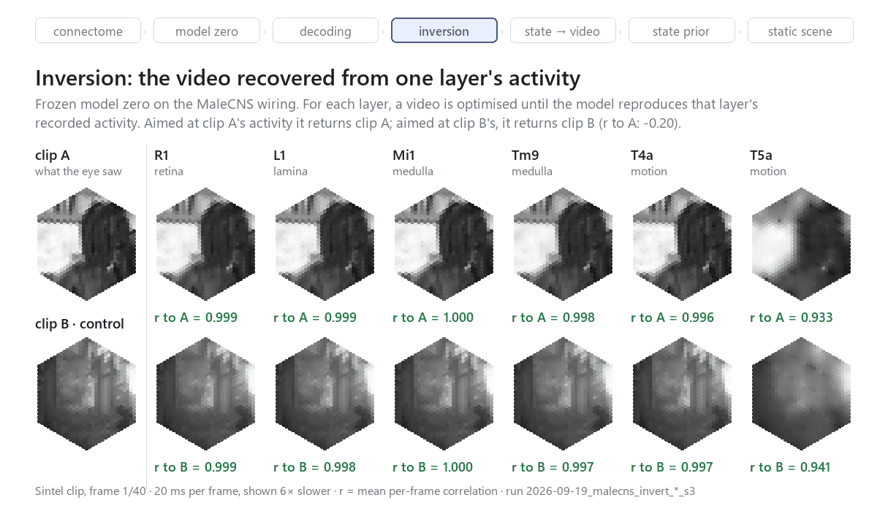

*Рис. 6. Инверсия модели ноль. Верхний ряд: видео, восстановленное из
активности одного уровня, и его корреляция с клипом A. Нижний ряд — контроль:
та же инверсия, нацеленная на состояние другого клипа B, возвращает клип B.
Шкала серого фиксирована, 0..1. Скрипт `tools/fig_gh_inversion.py`, запуски
`2026-09-19_malecns_invert_*_s3`.*

На одном клипе Sintel и десяти уровнях — от R1 до T4+T5 — инверсия вернула
вызвавший состояние ролик с r 0,93–1,00. Контроль — состояние другого клипа
как цель: результат к исходному клипу даёт r от −0,20 до −0,22, к своему
клипу — 0,94–1,00 на показанных уровнях. Инверсия возвращает то, на что
нацелена, а не одно и то же «среднее видео».

Та же инверсия с теми же настройками на эталонной сети FlyVis даёт почти те же
числа; разница заметна только на T5a — 0,971 у FlyVis против 0,933 у модели
ноль, то есть ровно на пути OFF из § 2.

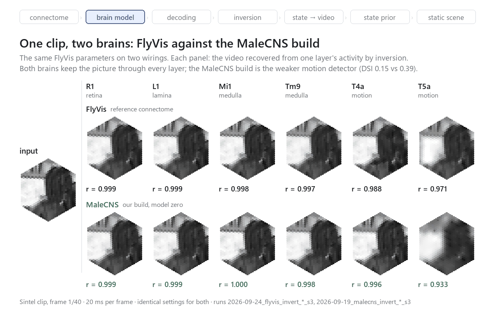

*Рис. 7. Один клип, два мозга: одинаковая инверсия на коннектоме FlyVis
(сверху) и на сборке MaleCNS (снизу), те же параметры члена 000, 40 кадров
плюс 5 кадров запаса, 150 шагов. Скрипт `tools/fig_gh_two_brains.py`.*

У рекуррентной сети нет будущего контекста, поэтому последние кадры окна
восстанавливаются хуже. Запас из пяти кадров в конце окна поднял последний кадр
T5a с 0,66 до 0,92, T4+T5 — с 0,80 до 1,00. Сравнение не чистое: вместе с
запасом изменилась и длина окна (20 → 40 кадров).

Точная формулировка результата: найден стимул, совместимый с состоянием
**этой модели** при данном оптимизаторе и регуляризации. Позже (§ 7) та же
инверсия на восьми отложенных клипах дала r 0,999–1,000 для трёх групп типов.
[Отчёт](2026-09-19_step9_window_margin.md), код `flydream/generate/invert.py`.

## 5. Инженерная линия: где нужна карта и как её загрузить

**Обучать саму модель MaleCNS не понадобилось.** Цикл обучения на полном
экспорте — около 17 с на итерацию на CPU под нагрузкой против 0,36–0,43 с на
T4 при батче 4. Дообучение отложено: генератору оно не нужно, пока модель ноль
его не ограничивает. [Отчёт о вариантах обучения](2026-09-18_step3_training_options.md).

**Пакетная инверсия — главное ускорение этой части.** Десять уровней и десять
контрольных целей раньше оптимизировались по очереди. Мы собрали 20 независимых
задач в одну batch-ось, у каждой своя маска клеток и своя функция ошибки.

| | по очереди | пакетом |
|---|---|---|
| время на T4 | 948 с | 127 с (оптимизация) / 176 с (вся лестница) |
| цена прогона | ≈ $0,17 | ≈ $0,05 |
| расхождение видео с последовательной версией | — | не больше 0,0007 при диапазоне 0–1 |

Ускорение — **7,1–7,5×** на оптимизации и **5,4–5,8×** на всей лестнице;
диапазон, а не одно число, потому что замер последовательного прогона не
разделяет время оптимизации и время всей лестницы. Корреляции видео совпали до
трёх знаков. Это ускорение не обучения, а *оптимизации видео через мозг*.
[Таблица замера](2026-09-19_step9_window_margin.md#item-10-the-ladder-batched-same-day).

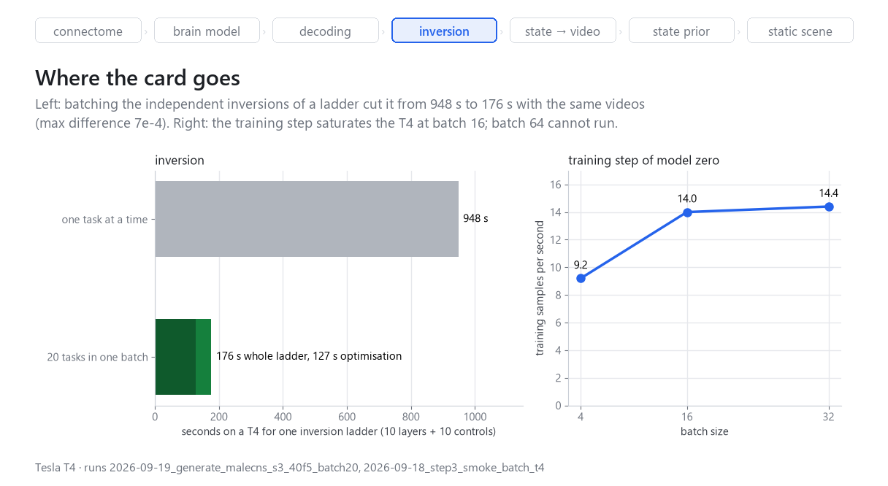

*Рис. 8. Слева: одна лестница инверсии на T4 по очереди и пакетом. Справа:
пропускная способность шага обучения модели ноль по размеру батча. Скрипт
`tools/fig_gh_charts.py`, запуски `2026-09-19_generate_malecns_s3_40f5_batch20`
и `2026-09-18_step3_smoke_batch_t4`.*

**Оптимизация шага обучения модели MaleCNS** на случай, если оно понадобится:

- два процесса на одной T4 дали 1,2–1,5×; четыре и восемь не пережили прогрев;
- батч 16 поднял пропускную способность до ~14 образцов/с, дальше плато;
- профиль показал, что шаг съедают gather (20 %), scatter_add (12 %) и умножения
  по рёбрам (20 %);
- перенос диагностических редукций на GPU и ReLU до gather дали 1,164× и 1,172×
  в двух парных повторах (1,136 → 0,973 с на итерацию при батче 16).

Потери совпали в пределах допуска; конечные состояния головы декодера формально
нет (разница до 4,3e-4 при расхождении двух эталонных запусков 3,0e-4).
Тридцать итераций не проверяют сходимость: это измеренная оптимизация кода, а
не доказательство равноценного обучения.
[Стенд](2026-09-18_training_optimization_bench.md).

**Правило карты.** Каждая функция на GPU делает только работу GPU и запрашивает
минимум CPU и памяти; независимые задачи упаковываются в один проход, пока
карта не загружена полностью. Эта часть проекта обошлась в несколько долларов
GPU; инженерия второй части — упаковка задач до 99 % загрузки T4, профилирование
шага, свой рендер глаза — собрана в её § 12.

## 6. Инверсия состояний, которых не вызывал ни один обычный клип

Мы подали в модель шум в глаз, вспышку, темноту после клипа и шум в активность
клеток, а затем инвертировали ответы каждого уровня рядом с переставленным
состоянием.

- **Шум в глазе:** восстановление зависит от уровня — от r 0,31 у T5a до 1,00 у
  R1 и Mi1; T4+T5 вместе — 0,98. Второй провал — Tm5a, 0,53. Переставленный
  контроль — около нуля.
- **Темнота после клипа:** у части уровней слабый короткий след (контраст не
  больше 0,008), к 20-му кадру — чёрное. Яркой «картинки сна» нет.
- **Шум в клетках:** слабая рябь.

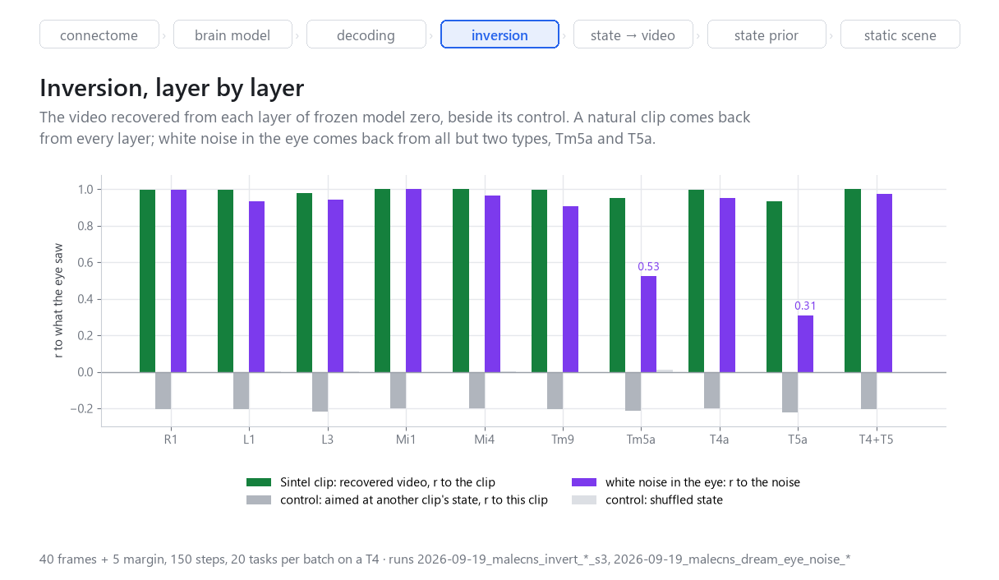

*Рис. 9. Инверсия по всем десяти уровням модели ноль: клип Sintel (§ 4) и
белый шум в глазе, каждый рядом со своим контролем. Скрипт
`tools/fig_gh_charts.py`, запуски `2026-09-19_malecns_invert_*_s3` и
`2026-09-19_malecns_dream_eye_noise_*`.*

[Отчёт](2026-09-19_step11_dreams_lite.md).

Потом мы меняли уже снятые состояния:

- **Усиление одного типа.** T4a × 2 почти не меняет видео (r 0,99 к исходному),
  но круговой ход растёт в тысячи раз (0,492 против 6e-5). Повернуть
  «ручку T4a», сохранив остальное, нельзя.
- **Смесь состояний двух клипов.** Состояние T4a, усреднённое по двум клипам,
  даёт видео, почти совпадающее с попиксельным средним двух роликов (r 0,99).
  Это говорит о линейности отображения «видео → состояние T4a», а не о новой
  промежуточной сцене: попиксельное среднее — это двойная экспозиция. Шкала
  нужна рядом: один чистый клип A уже даёт с этим средним 0,81. Во второй
  части то же свойство всплывёт как дефект генератора.
- **Гибриды уровней** (ранние типы от одного клипа, T4/T5 от другого) — это
  состязание, и T4/T5 побеждают: в одном из вариантов видео на 0,88 похоже на
  клип, отданный T4/T5, и на 0,15 — на другой. Круговой ход остаётся 0,15.

Так ещё до обученного генератора стала видна граница достижимого состояния.
[Отчёт](2026-09-19_step12_manipulated_states.md).

## 7. Амортизированная инверсия: линейная модель и CNN

Инверсия требует сотни шагов под каждую цель. Мы построили пары
`видео → состояние` из Sintel и процедурных стимулов — 9 468 клипов: движения,
вспышки, шум, текстуры; целые сцены и классы стимулов отложены для проверки —
и обучили два быстрых декодера для трёх групп типов (ранние L1/L3, глубокие
T4a–d/T5a–d и все 14 типов):

- **линейную модель** с общей гексагонально-временной свёрткой;
- маленькую нелинейную **гекс+временную CNN**.

На глубокой группе и 1 996 отложенных клипах покадровая корреляция — **0,927**
у линейной модели и **0,960** у CNN. Круговой ход на восьми отложенных клипах,
взятых равномерно по тестовому набору: 0,036 у линейной модели, 0,029 у CNN и
0,009 у медленной инверсии. Контроль с перемешанными клетками даёт 2,9–4,5.

Это дешёвая одношаговая аппроксимация обратного отображения — **амортизированная
инверсия**, а не доказательство, что CNN следует любому произвольному
состоянию. Контроля с перемешиванием по времени у этих чисел нет.
[Отчёт 13A](2026-09-19_step13a_amortised_inversion.md).

## 8. SiT: генерация с нейронным условием

Следом — условный поток (SiT, 1,40 млн параметров): восемь типов T4/T5, маска
доступных типов и шум `z` дают все 40 кадров видео за 20 шагов Эйлера. 20 000
шагов обучения на T4, ≈ $0,22. Этот генератор, **13B**, — рендерер всей второй
части.

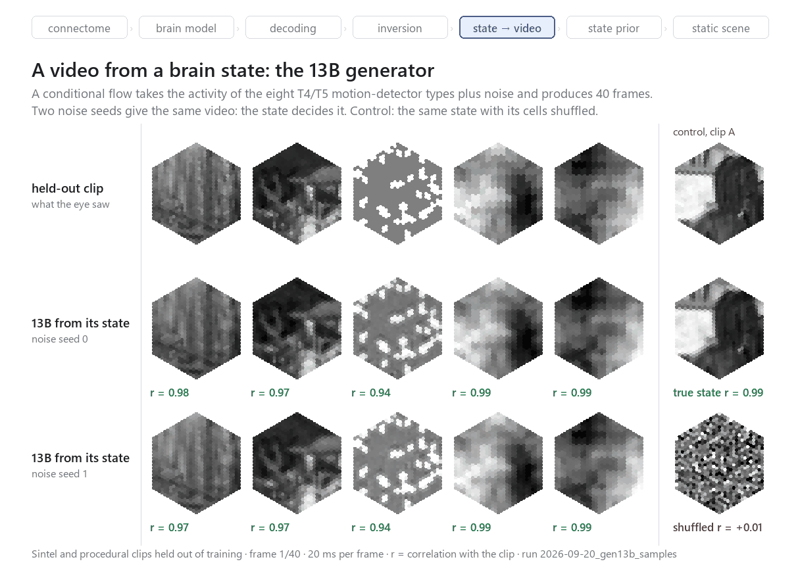

*Рис. 10. 13B на отложенных клипах. Сверху клип, ниже — видео из его состояния
T4/T5 при двух разных шумах. Справа контроль на клипе A: то же состояние и
тот же шум, но с перемешанными клетками, дают другое видео. Скрипт
`tools/fig_gh_render.py`, запуск `2026-09-20_gen13b_samples`.*

| | значение |
|---|---|
| r к исходному видео, 8 отложенных клипов | **0,966** |
| один и тот же `z`, истинное состояние против перемешанного: r между выходами | **0,03** |
| видео из перемешанного состояния: r к клипу | 0,00 |
| круговой ход | 0,031 |
| разброс по сидам при полном состоянии | r 0,96–0,99 между образцами |
| разброс по сидам при условии только на T4a (один клип, 4 сида) | r 0,82 |

Картинку делает состояние, а не априорное знание модели: при одном `z` смена
состояния на перемешанное даёт другое видео. Полное состояние T4/T5 почти
задаёт клип; условие на одном T4a оставляет генератору заметную свободу.

**Где условие не выполняется.** На сильных ручных правках T4/T5 круговой ход
остаётся большим (0,29–1,47): априорное знание SiT побеждает условие.
«Генеративная модель» здесь — способ создания видео, а не гарантия выполнения
любого условия.

Две оговорки к числам:
- **Круговой ход мерит совместимость видео с мозгом, а не содержание.** Во
  второй части (§ 5) он поставит почти пустому серому полю оценку лучше, чем
  настоящему клипу. Здесь он читается только рядом с визуальной проверкой.
- **Круговые ходы 13A и 13B посчитаны с разной нормировкой** (по всем восьми
  клипам против одного клипа), поэтому 0,029 у CNN и 0,031 у SiT нельзя
  сравнивать напрямую. Приблизительный пересчёт на общую шкалу даёт CNN около
  0,033 ([ISS-0014](../ISSUES.md)).

[Отчёт 13B](2026-09-20_step13b_generative_decoder.md).

## 9. Границы генератора: новые условия и замкнутый цикл

Что будет, если условие не является состоянием одного клипа?

Числа в этом разделе — средние по двум шумам генератора.

- **Случайная активность T4/T5** даёт видео, но слабую совместимость: круговой
  ход 1,85 для белого и 2,33 для структурированного шума против 0,029 у
  состояния обычного клипа.
- **Перестановки и повороты каналов направления** не стали ручками: 2,2–9,5.
  Обращение во времени — 1,0 и 5,5, усиление одного направления — 0,68.
- **Нарисованная вручную полоска T4a** почти проигнорирована: видео серое. При
  этом круговой ход у неё 0,095 — ниже, чем у любого удачного условия ниже.
  Это первое место, где видно, что круговой ход не отличает выполненное
  условие от проигнорированного.

**Пространственные композиции настоящих ответов модели** — движение вправо в
левой половине и влево в правой, движение рядом с расширением, движение вверх в
окне — дают правдоподобное видео, которого нет ни в одном клипе (круговой ход
0,10–0,14). Насколько условие выполнено, пока видно только глазом и только на
первом сиде: грубая метрика «какое направление T4 доминирует в видео» совпадает
с заданным в двух случаях из шести (три композиции × два сида). Это узкий
способ задать новое состояние, а не язык нейронных промптов.

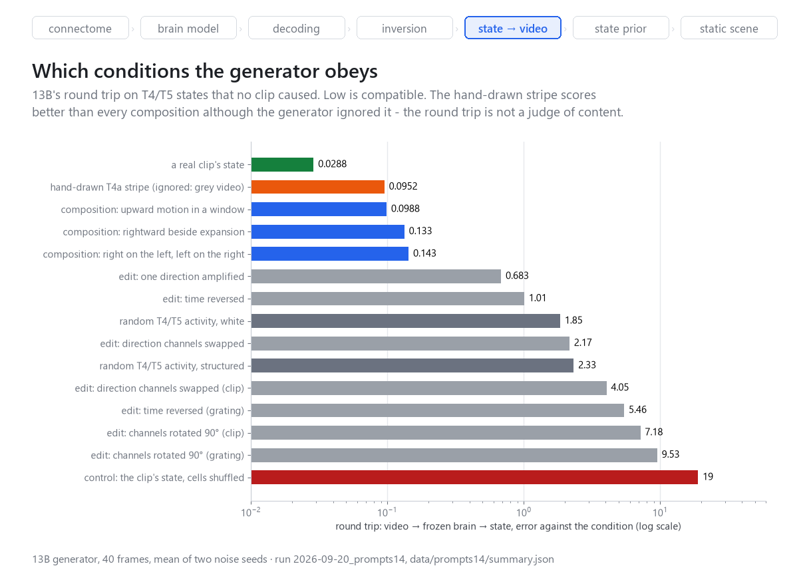

*Рис. 11. Круговой ход 13B на условиях, которых не вызывал ни один клип.
Проигнорированная полоска (оранжевая) выглядит совместимее всех композиций.
Скрипт `tools/fig_gh_charts.py`, запуск `2026-09-20_prompts14`.*

**Замкнутый цикл** `состояние → SiT → видео → модель → состояние → …`: каждая
соседняя пара совместима (круговой ход 0,02–0,05), но содержание дрейфует — r к
исходному клипу падает с 0,99 до 0,26 за 11 проходов. Это динамика *связки*
генератора и энкодера, а не аттрактор мозга мухи.

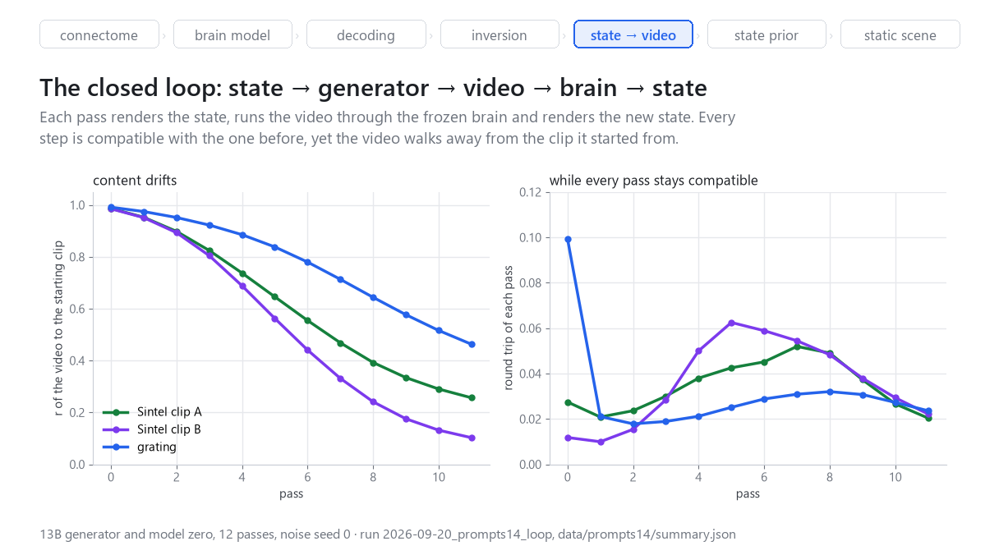

*Рис. 12. Замкнутый цикл из трёх стартов: сходство видео с исходным клипом
по проходам и круговой ход каждого прохода. Скрипт `tools/fig_gh_charts.py`,
запуск `2026-09-20_prompts14_loop`.*

[Отчёт 14](2026-09-20_step14_controllable_generator.md).

## 10. Что получилось и откуда начинается вторая часть

Сквозной работающий контур:

`проводка MaleCNS → модель зрительной доли → ответы по уровням →
линейное чтение / инверсия / CNN / SiT → видео → повторный прогон через модель`.

Вклад проекта — не утверждение, что мы раскрыли зрение мухи, а собранный
конвейер и его проверка: экспорт коннектома с явной геометрией колонок,
найденная и исправленная ошибка переноса параметров, декодирование по уровням с
контролями, генерация из T4/T5 и пакетное ускорение дорогой инверсии.

Отрицательные результаты не менее важны:
- протокол, который мерил повторяемость стимула вместо информации;
- лестница уровней, созданная окном декодера;
- ошибка масштаба при переносе параметров;
- пространственный дефект пути OFF, который не поймал ни один протокол и
  увидела только картинка слоёв;
- произвольные состояния, которые генератор отказывается выполнять;
- дрейф замкнутого цикла.

**Ограничения.** Модель ноль — более слабый детектор движения, чем FlyVis, и
её путь OFF неисправен (ISS-0015); одна сторона одного самца, один порог
синапсов, параметры перенесены, а не обучены на этой проводке. Все числа
сняты с одного разбиения данных и одного члена или трёх членов ансамбля.

**Главный предел этой части — источник состояния.** Мы умеем отрисовать любое
достижимое состояние, но каждое из них было снято с какого-то видео. Вторая
часть — о том, как выучить распределение состояний и разыгрывать из него
новые.

## Воспроизведение

Все иллюстрации лежат в [`docs/figures/`](../docs/figures/) и собираются
локально скриптами из `tools/` по сохранённым запускам:

```bash
uv run python tools/fig_gh_connectome.py   # рис. 1
uv run python tools/fig_gh_layers.py       # рис. 3
uv run python tools/fig_gh_decoding.py     # рис. 5
uv run python tools/fig_gh_inversion.py    # рис. 6
uv run python tools/fig_gh_two_brains.py   # рис. 7
uv run python tools/fig_gh_render.py       # рис. 10
uv run python tools/fig_gh_charts.py       # рис. 2, 4, 8, 9, 11, 12
```

Каждое число статьи ведёт к отчёту шага в `reports/` и к записи в
[`reports/runs.jsonl`](runs.jsonl) с идентификатором запуска; известные
дефекты — в [`ISSUES.md`](../ISSUES.md).

## Литература

- Lappalainen J. K. et al. Connectome-constrained networks predict neural
  activity across the fly visual system. *Nature* 634, 1132–1140 (2024). —
  архитектура, параметры и протоколы FlyVis.
- Berg S. et al. Sexual dimorphism in the complete connectome of the
  *Drosophila* male central nervous system. *Cell* (2026). — коннектом
  MaleCNS v1.0, Janelia FlyEM, CC-BY 4.0.
- Bauer J., Margrie T. W., Clopath C. Movie reconstruction from mouse visual
  cortex activity. *eLife*, reviewed preprint 105081 (2026). — восстановление
  видео инверсией энкодера.
- Chen Y. et al. Decoding dynamic visual scenes across the brain hierarchy.
  *PLOS Computational Biology* (2024), doi:10.1371/journal.pcbi.1012297. —
  декодируемость по уровням и контроли.
- Ma N. et al. SiT: Exploring flow and diffusion-based generative models with
  scalable interpolant transformers. *ECCV* (2024). — условный поток 13B.
- Butler D. J. et al. A naturalistic open source movie for optical flow
  evaluation. *ECCV* (2012). — видео Sintel.
